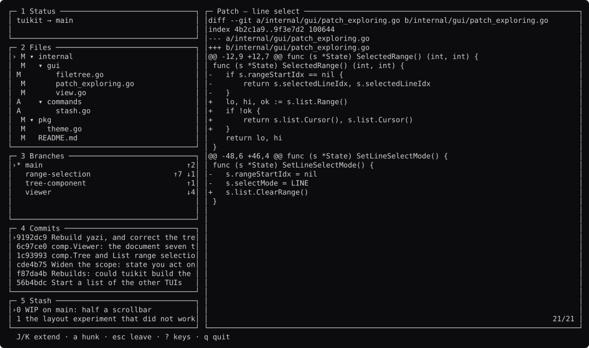

# tuikit rebuilds

Could [tuikit](https://github.com/richarddavenport/tuikit) build the terminal
interfaces people actually use?

Eleven of them were read from source, worked out on paper, and then **built**.
Each has a `STUDY.md` saying what the original does and what tuikit was missing,
and a working program that draws its interface against a fixture.

**Two questions run through this repository, and they are not the same one.**

1. **Could tuikit draw it?** That is the coverage test, at the top of each
   `STUDY.md`. All eleven now answer yes. Six of them only answer yes because
   the study made us go and build something first.
2. **Would it have been easier in tuikit?** That is the verdict, at the bottom
   of each `STUDY.md` and in the last column of the table below. It says *no*
   for three of the eleven.

A tool can be perfectly drawable and still have been better off written the way
it was. bottom is the clearest case of both at once.



## The eleven

All eleven are **built**. Each runs, is screenshotted, and has its screens held to
a golden at two terminal sizes.

| | run it | study | screens | easier in tuikit? |
| --- | --- | :---: | :---: | --- |
| [lazygit](lazygit/) | `go run ./lazygit` | [✓](lazygit/STUDY.md) | [7](lazygit/docs/screens.md) | about even |
| [gcpeasy](gcpeasy/) | `go run ./gcpeasy -fixture` | [✓](gcpeasy/STUDY.md) | [9](gcpeasy/docs/screens.md) | **tuikit, by the most** |
| [k9s](k9s/) | `go run ./k9s` | [✓](k9s/STUDY.md) | [11](k9s/docs/screens.md) | **tuikit** |
| [bottom](bottom/) | `go run ./bottom` | [✓](bottom/STUDY.md) | [8](bottom/docs/screens.md) | the original, on layout-as-data |
| [gitui](gitui/) | `go run ./gitui` | [✓](gitui/STUDY.md) | [11](gitui/docs/screens.md) | **tuikit** |
| [termshark](termshark/) | `go run ./termshark` | [✓](termshark/STUDY.md) | [9](termshark/docs/screens.md) | close, since `comp.Focus` |
| [yazi](yazi/) | `go run ./yazi` | [✓](yazi/STUDY.md) | [10](yazi/docs/screens.md) | even — depends on your users |
| [dive](dive/) | `go run ./dive` | [✓](dive/STUDY.md) | [7](dive/docs/screens.md) | **tuikit** |
| [fx](fx/) | `go run ./fx` | [✓](fx/STUDY.md) | [7](fx/docs/screens.md) | the original, at scale |
| [gh-dash](gh-dash/) | `go run ./gh-dash` | [✓](gh-dash/STUDY.md) | [9](gh-dash/docs/screens.md) | **tuikit, on `app`** |
| [htop](htop/) | `go run ./htop` | [✓](htop/STUDY.md) | [12](htop/docs/screens.md) | **tuikit**, on a small half |

**100 screens**, all generated from fixtures. None is a screenshot anybody took,
and none can go stale without a test failing first.

**7,157 lines of interface across eleven tools**, counting every non-blank,
non-comment line of Go outside the fixtures and the tests. The largest single
`view.go` is 289.

```
$ find . -name '*.go' ! -name '*_test.go' ! -path '*/fake/*' \
    | xargs cat | grep -vE '^\s*(//|$)' | wc -l
```

gcpeasy is 1,730 of that and is not comparable to the rest: it is the one built
as a real tool, with an engine and a CLI behind the interface.

## What building them found

Reading source finds gaps. Building finds different ones — six of these were
invisible from the outside:

| found by building | what happened |
| --- | --- |
| `Row.Lead` replaced `List.Marker`, so a status glyph cost you the cursor | fixed, [tuikit#64](https://github.com/richarddavenport/tuikit/issues/64) |
| nothing held which pane had focus | `comp.Focus`, [#59](https://github.com/richarddavenport/tuikit/issues/59) |
| the selection set, and two tools disagreed about its shape | `comp.Marks`, [#55](https://github.com/richarddavenport/tuikit/issues/55) |
| no chart, and bottom had already said what one needs | `comp.Sparkline`, [#58](https://github.com/richarddavenport/tuikit/issues/58) |
| no sort state | `comp.Sort`, [#61](https://github.com/richarddavenport/tuikit/issues/61) |
| `Row.Depth` indents `Row.Lead`, so a status column and a tree indent cannot coexist | open, [#66](https://github.com/richarddavenport/tuikit/issues/66) |

And four more, filed on 2026-09-05 after a sweep of every study for gaps that
had been named but never written down:

| found | filed |
| --- | --- |
| `comp.Tree` cannot fold a closing bracket — a `}` is a sibling of its `{` | [#74](https://github.com/richarddavenport/tuikit/issues/74) |
| `Viewer.NoCursor` disables the range too, so a *derived* highlight cannot exist | [#75](https://github.com/richarddavenport/tuikit/issues/75) |
| no column equivalent of `List.Overhead`, whose name invites the bug | [#76](https://github.com/richarddavenport/tuikit/issues/76) |
| a dragged range must be derived, not accumulated — `List.Move` is deferred | [#77](https://github.com/richarddavenport/tuikit/issues/77) |
| `comp.Tree` indents but draws no branches, and depth cannot say which connector | [#78](https://github.com/richarddavenport/tuikit/issues/78) |

Reading the studies again found five more that no rebuild had hit, because they
are things the originals have and the rebuilds simply did without:

| the original has | filed |
| --- | --- |
| gitui's popup stack — 32 popups, and `app.Stack` is about screens | [#69](https://github.com/richarddavenport/tuikit/issues/69) |
| lazygit's 743 file-icon brand colours, which `guard.Tokens` would wrongly reject | [#70](https://github.com/richarddavenport/tuikit/issues/70) |
| k9s's deltas — ↑ ↓ Δ on every cell that changed since the last refresh | [#71](https://github.com/richarddavenport/tuikit/issues/71) |
| termshark's copy mode over a **table** and a **tree**, not just a list | [#72](https://github.com/richarddavenport/tuikit/issues/72) |
| yazi's completion popup over an input | [#73](https://github.com/richarddavenport/tuikit/issues/73) |

## Would it have been easier in tuikit?

Each study ends with this, and it is a different question from "could tuikit
draw it". Three of the ten still come out against us, and two of those changed
after the components they asked for were built.

| | easier in tuikit? | because |
| --- | --- | --- |
| [gcpeasy](gcpeasy/) | **yes, by the most** | 291 lines of drawing against 624, and four tests stop being writable |
| [gh-dash](gh-dash/) | **yes, on `app`** | its `Update` is 741 lines; the rebuild's is **32**, and a test says so |
| [gitui](gitui/) | **yes** | 32 popup files, and the generic half of them is four components |
| [dive](dive/) | **yes** | its interface is one tree, one list, a detail pane and a filter |
| [k9s](k9s/) | **yes**, now `comp.Marks` exists | one key means "the marked ones" and "this one", with no branch |
| [termshark](termshark/) | **close**, now `comp.Focus` exists | its study said no; three panes moved by region name is the answer |
| [lazygit](lazygit/) | about even | saves a style system, and `Row.Depth` still fights a status column |
| [yazi](yazi/) | even, depends on your users | quicker to write, and it loses the Lua its users extend |
| [bottom](bottom/) | **the original** | not the charts any more — its layout is a TOML file and ours is compiled in |
| [fx](fx/) | **the original** | its linked-list tree is faster than `comp.Tree` at scale |

Every verdict has four parts: what you would not write, what you would write
anyway, where tuikit gets in the way, and **where the original is better**.

That last part is required to be non-empty. A verdict that cannot name one
thing the original does better has not been written carefully enough — and in
practice every one of them could, including the tools tuikit clearly wins on.
Some of what came out of it:

- fx's tree is a linked list, so folding is a pointer hop and drawing never
  touches what is hidden. `comp.Tree` walks every node, every frame.
- bottom forked its framework's chart because the framework's was wrong about
  right-aligning a time series. That is a framework being worse than the fork.
- termshark's toolkit makes focus a property of the widget tree. Ours makes it
  a bool you remember to set.
- k9s got a tree from `tview` for free. tuikit is immediate mode and never will.
- gcpeasy's task pane runs commands under a PTY and renders the output. The
  rebuild lost that, and decision 27 says we will not help.

## What this repository is careful about

The obvious thing to write here is that tuikit is better. Two claims of exactly
that shape have already been made in this work and both had to be retracted
after they were measured:

- *"gcpeasy's 2,972-line TUI is what a tool pays for not using tuikit."* Measured
  afterwards: 624 of those lines are drawing. The rest is the program.
- *"gh-dash's `ui.go` is 54 kB of exactly the state management `app` was
  extracted to remove."* Measured afterwards: 741 of its 1,917 lines are one
  `Update` function. True about the kind of code, wrong about the amount.

Both are in [tuikit's claim log](https://github.com/richarddavenport/tuikit/blob/main/design/research/other-tuis.md#claims-that-failed-this-check).

So [METHOD.md](METHOD.md) requires every comparison to be one of four things:
lines of drawing code, a test that stops being necessary, a guard that would
fire, or a component that did not have to be written. Anything else is an
opinion and does not go in a README.

It also requires reporting the ones that go the other way. The lazygit rebuild
found a guard that fires **and is wrong**, and says so.

## What the studies found

Ten tools, read from source. The components that came out of it:

| found by | became |
| --- | --- |
| lazygit, dive, termshark, fx each wrote a collapsible tree | `comp.Tree` |
| lazygit and gitui both wrote a line range over a diff | `List.Extend`/`Range` |
| seven tools wrote a scrollable view that does not tail | `comp.Viewer` |

And the ones still open, each with its evidence attached: a
[selection set](https://github.com/richarddavenport/tuikit/issues/55) (3 tools),
[panel focus](https://github.com/richarddavenport/tuikit/issues/59) (5 tools),
a [time series](https://github.com/richarddavenport/tuikit/issues/58) (2),
[table sort](https://github.com/richarddavenport/tuikit/issues/61) (2),
[ANSI from a subprocess](https://github.com/richarddavenport/tuikit/issues/63) (1).

Three claims made along the way turned out to be false and were withdrawn.
yazi, superfile and ranger were each cited as needing a tree; none of them has
one, and all three are Miller-column file managers. That correction sharpened
the claim rather than weakening it: **every file manager in the field chose
columns over a tree**, and what needs a tree is a hierarchy you cannot walk into
— image layers, a JSON document, a packet dissection, a git status.

## Running them

```
go run ./lazygit          open it
go run ./lazygit -shots   regenerate its screenshots
go test ./...             every screen against its golden, at two sizes
```

Every rebuild is captured at 132×38 and at 80×24, and every frame is checked
with the colour stripped — a distinction only colour makes is a distinction lost
in a pipe.

## What a rebuild is allowed to conclude

That tuikit could or could not draw this interface, and what was missing.

**Not** that the original should have used tuikit. lazygit predates it by nine
years, most of these are not written in Go, and every one of them works.

## The verdict

**Can tuikit build the terminal interfaces people use? Yes — ten out of ten,
and the two it could not are now three components and a bug fix later.**

That is the honest headline and it needs three qualifications, in order of how
much they cost.

### 1. The fixtures are doing real work

Every rebuild draws against canned data. `comp` never had to cope with a
1.4-million-line diff, a `kubectl` that hangs, a terminal that lies about its
width, or ten years of bug reports. **fx's study says no for exactly this
reason**, and the rebuild cannot disprove it: a 25-line fixture cannot show a
problem that starts at a million nodes.

So this survey answers *can the interface be drawn*. It does not answer *does it
hold up*, and no repository of fixtures ever will.

### 2. Most of any tool is not its interface

The ten rebuilds are **6,568 lines of interface**. The originals are hundreds of
thousands of lines, and almost all of that is the domain: git plumbing,
Kubernetes clients, PDML parsing, `/proc` readers, GraphQL.

`comp` and `app` never touch that, and the studies say so per tool under
*theirs*. A framework that saves you the interface has saved you the smaller
half. Worth saying plainly, because a repository like this makes it easy to
forget.

### 3. Three things the originals still do better

Each names one, and they are not throwaway concessions:

- **fx's tree is a linked list.** Folding is a pointer hop and drawing never
  touches what is hidden. `comp.Tree` walks every node, every frame, with a map
  lookup per row.
- **bottom's and gh-dash's layouts are files their users write.** TOML and YAML
  respectively. tuikit cannot load a layout from data, and for a dashboard
  "the user arranges it" is a large part of the product
  ([#60](https://github.com/richarddavenport/tuikit/issues/60)).
- **yazi's whole main surface is replaceable Lua.** tuikit declined that bet on
  purpose, because a surface drawn by a user's script cannot be checked by
  reading the program — and the guards are the property tuikit exists for.
  Both bets are defensible; 42k people like the other one.

### What actually changed

The survey started as a coverage test and turned into a development loop. Ten
studies produced six components — `Tree`, `Viewer`, `List.Range`, `Focus`,
`Marks`, `Sparkline`, `Sort` — and **every one of them came from evidence rather
than from taste.** None was built because somebody thought it would be useful.

Three claims made along the way turned out to be false and were withdrawn: yazi,
superfile and ranger were each cited as needing a tree and none has one. That
correction sharpened the claim rather than weakening it — *every file manager in
the field chose Miller columns over a tree.*

**The most useful single result** is not in any of the ten. It is that building
one tool for real, against a live backend, found two gaps that reading nine
others had not. Reading source tells you what people wrote. Building tells you
what they could not.
