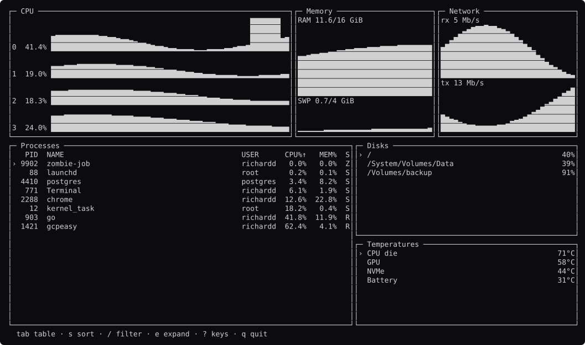
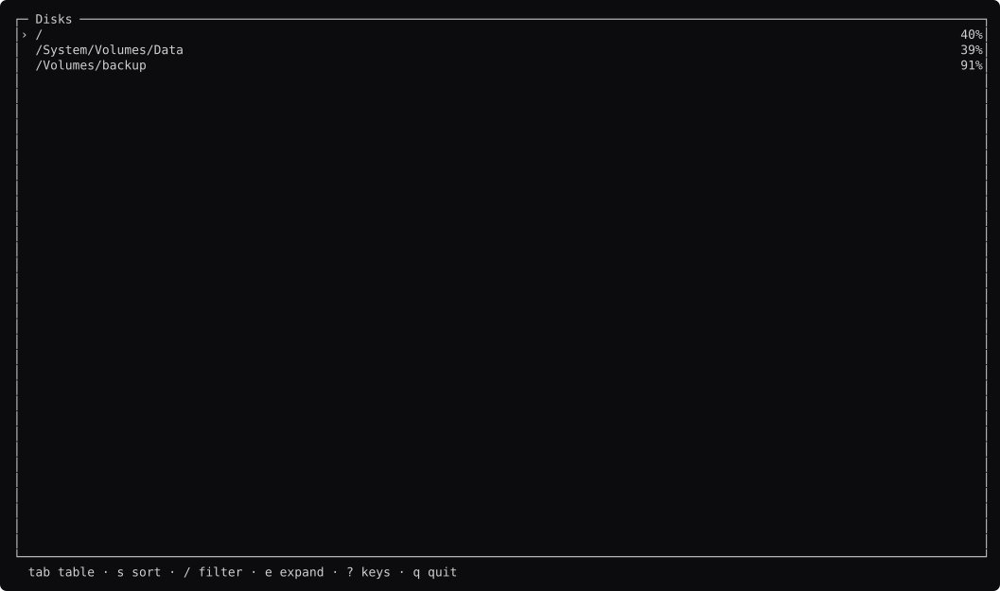
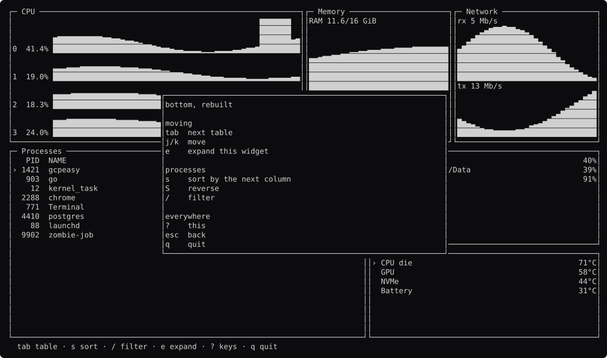

# bottom, screen by screen

Generated by `go run ./docs -shots`. Edit the capture, not this file.

### browsing

Six widgets. `comp.Layout` nests — rows of columns of rows — which is bottom's grid without a constraint solver.

### charts

Every `comp.Sparkline` on screen. The newest sample is the LAST column, so the CPU-0 spike sits where now is.

### sorted-cpu

`s` to CPU%. `comp.Sort` hands back indices; the comparison stays the tool's.

### sorted-desc

`S` reverses. Stable, so the two processes at 0% keep the order the fixture built them in.

### filtering

`/` captures the keyboard. `j` is the letter j while it does.

### disks-focused

`tab`. `comp.Focus` moves the keyboard by region NAME, so a widget added to the ring cannot silently steal it.

### expanded

`e` gives the focused table the whole screen. The same draw function, a bigger rect.

### help

`?`.

