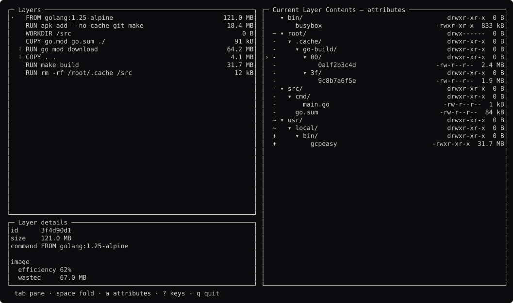

# dive, rebuilt

```
go run ./dive          open it
go run ./dive -shots   regenerate the screenshots
```

It does not read docker images. See [`fake/`](fake/).



Every screen: **[docs/screens.md](docs/screens.md)**. The analysis:
**[STUDY.md](STUDY.md)**.

## The first study that came back "yes"

dive's interface is one tree, one list, a detail pane and a filter, and `comp`
supplies all four. The rebuild is about 450 lines.

`pkg` in the original: `ui/v1/view/filetree.go` (13.2 kB) and
`ui/v1/viewmodel/filetree.go` (13.7 kB) are the drawing and view-model halves
of its tree. `comp.Tree` plus `comp.List` with an indent covers both.

What it does **not** cover, and correctly: `dive/filetree/file_tree.go` and
`file_node.go` build a tree from a docker image's layers and diff one against
the next. That is the program.

## Its own issue tracker says what tuikit is for

dive has **170 open issues** and has not been committed to since 2025-12-15. The
[study](STUDY.md#the-issue-audit) reads all of them.

**13 are things tuikit prevents or supplies outright.** Four of those are one
bug: a cursor that outlives the rows it pointed at.

| dive | |
| --- | --- |
| [#295](https://github.com/wagoodman/dive/issues/295) | a **panic** — `index out of range [15] with length 15`, from holding ↓ |
| [#259](https://github.com/wagoodman/dive/issues/259), [#308](https://github.com/wagoodman/dive/issues/308) | the cursor going below the end of a filtered tree |
| [#474](https://github.com/wagoodman/dive/issues/474) | the layout breaking under `LANG=ko_KR.UTF-8` |
| [#525](https://github.com/wagoodman/dive/issues/525) + 2 others | show the contents of a file |
| [#341](https://github.com/wagoodman/dive/issues/341) + 2 others | sort the tree by size |

`List.resolve` is handed the row count every frame and clamps to it, so the
first three cannot occur. The Korean one is a width bug and the canvas measures
every cluster. The last two are `comp.Viewer` and `comp.Sort`, both extracted
from other tools before anyone read this tracker.

**Two were open in tuikit as well, and are now fixed.**
[#468](https://github.com/wagoodman/dive/issues/468) wants the cursor to stay on
the same *node* when a filter clears, not the same *line*. Our htop rebuild had
that bug too, with a test that proved it.

[tuikit#80](https://github.com/richarddavenport/tuikit/issues/80) added an
opt-in `Row.Key`, and the fix in the rebuild is one field:

```go
row := comp.Row{Key: itoa(rows[i].PID), Text: lines[i+1]}
```

`TestTheCursorFollowsItsProcess` is the same test, flipped from asserting the
bug to asserting the fix. Everything in `comp` is now keyed by identity,
including the cursor.

## What it found

**`Row.Depth` indents `Row.Lead`** ([tuikit#66](https://github.com/richarddavenport/tuikit/issues/66)).

dive's question is "what did this layer remove", and you answer it by running
your eye down a column of `+ ~ -` marks. Indented with the filenames, the marks
march right and stop being a column. The first frame drawn showed it.

lazygit's rebuild needed exactly the same thing for git status letters. Two
tools, so it is filed. Both work around it the same way: `Depth: 0`, and the
indent built into `Text`.

## The rule worth stealing

**dive's four change states are characters, not colours.**

```go
func changeMark(c fake.Change) string {
	switch c {
	case fake.Added:    return "+"
	case fake.Modified: return "~"
	case fake.Removed:  return "-"
	}
	return " "
}
```

`harness.ShapeSurvivesColour` would not catch the alternative. Strip the colour
from a frame where change is carried by hue and the shape is unchanged — the
information is what goes missing. There is a test here that asserts the marks
survive.
