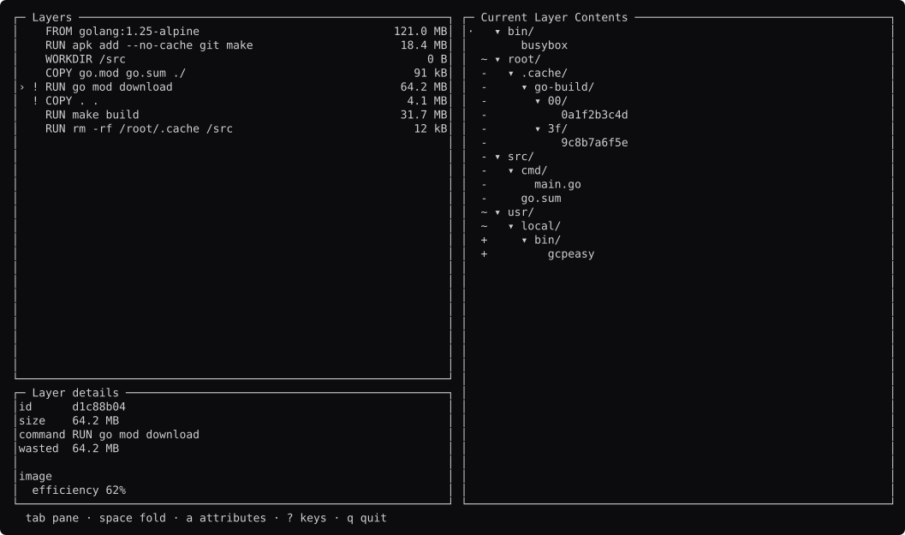
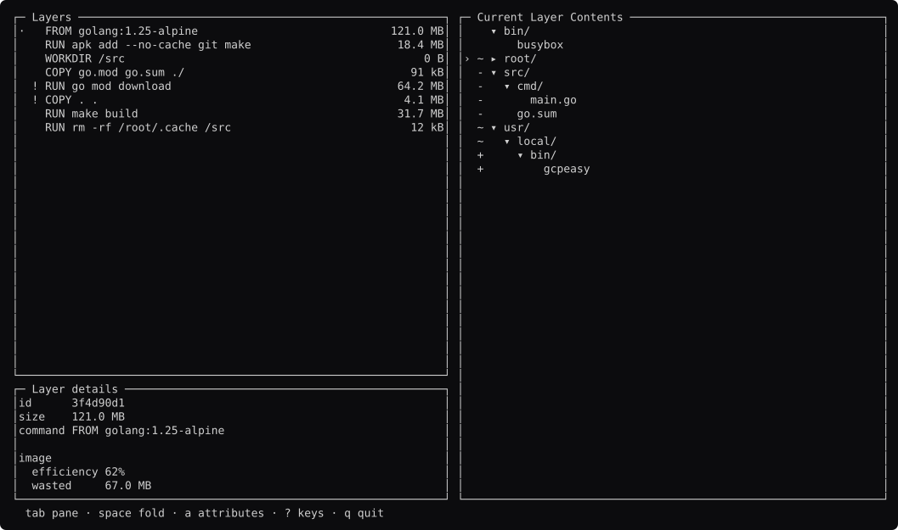
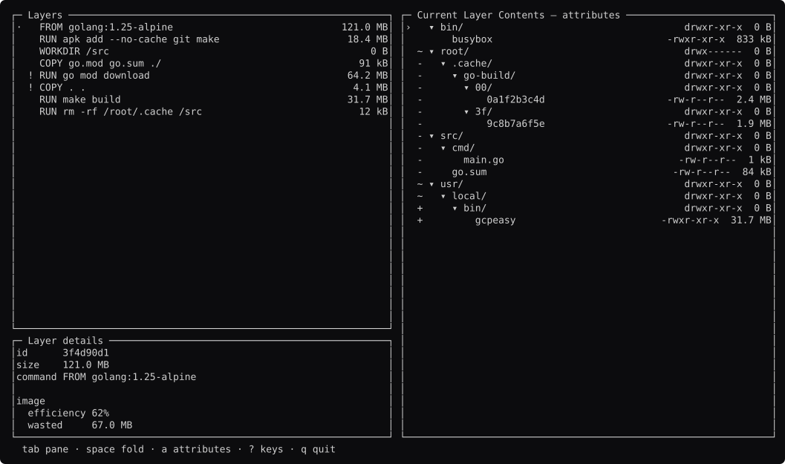
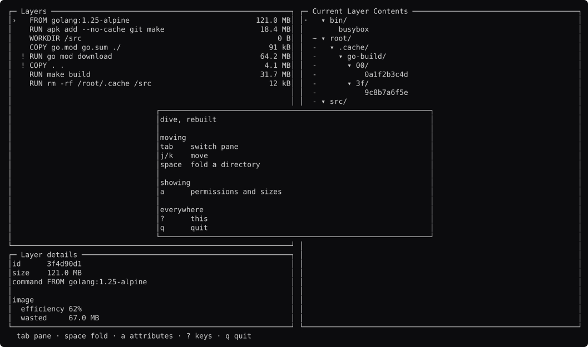

# dive, screen by screen

Generated by `go run ./docs -shots`. Edit the capture, not this file.

### browsing

Layers left, the filesystem they produced right. The `!` marks a layer whose bytes a later one throws away.

### wasted-layer

`go mod download` adds 64 MB and `rm -rf` deletes it. `comp.Detail` says so in facts.

### tree-focused

`tab`. `comp.Focus` holds which pane has the keyboard; the cursor is a different CHARACTER, not just a different colour.

### folded

`space` on a directory. `comp.Tree` decides which rows exist; the ▸ is the tool's.

### attributes

`a` adds permissions and sizes on the right. `Row.Right` right-aligns them without anyone doing padding arithmetic.

### deep

Inside the build cache, which is what dive exists to find.

### help

`?`.

