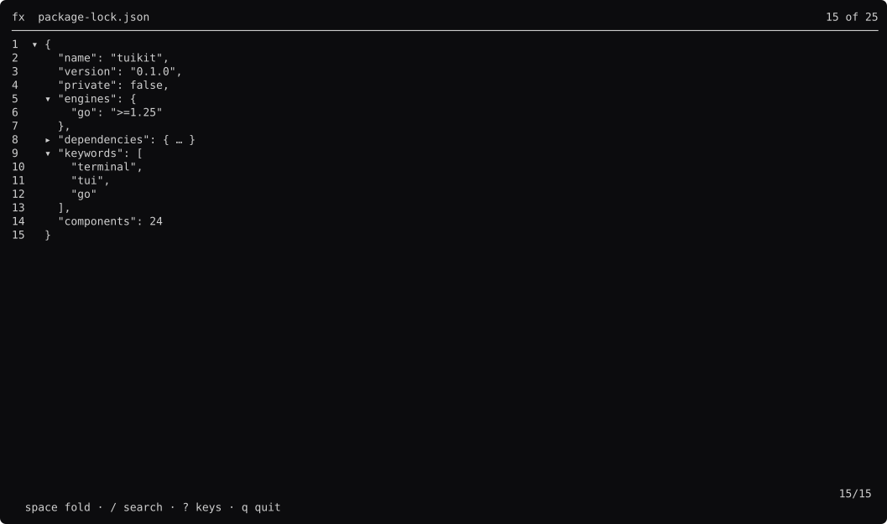
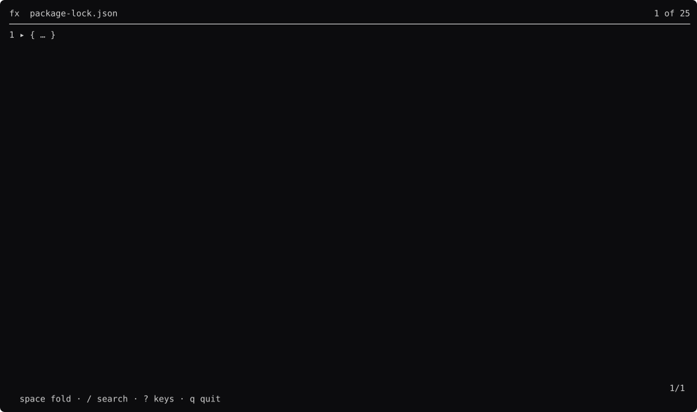
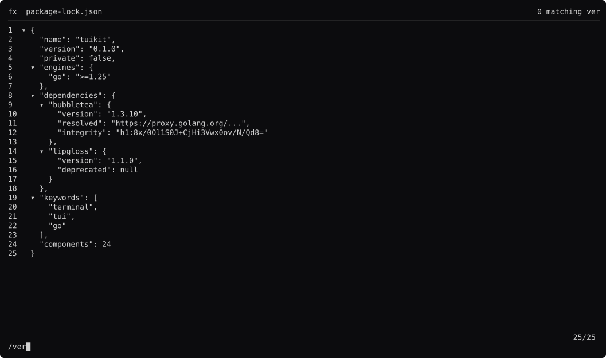
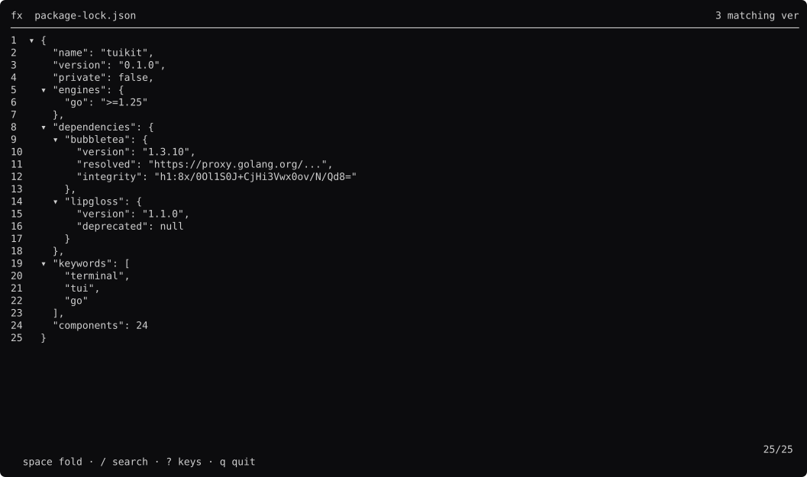
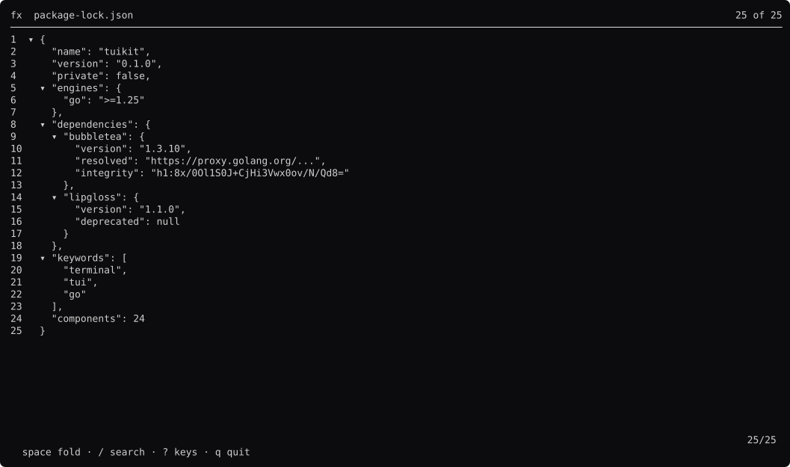
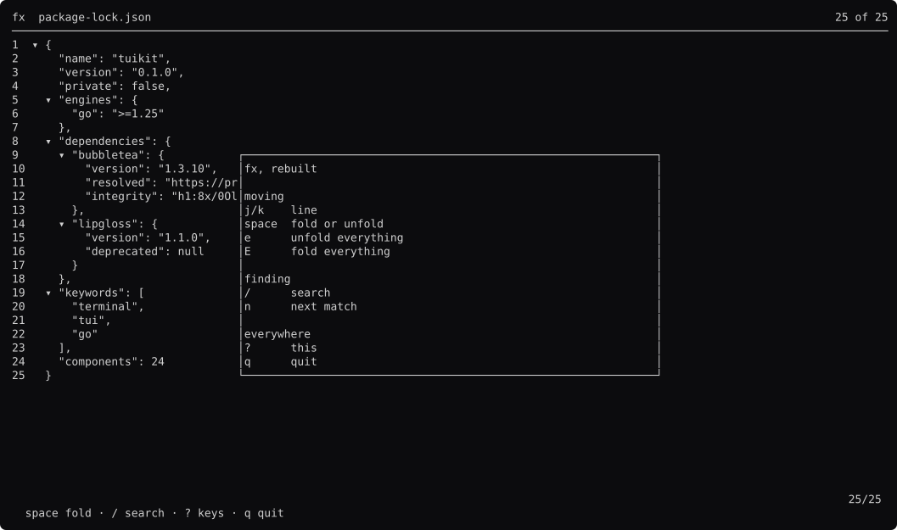

# fx, screen by screen

Generated by `go run ./docs -shots`. Edit the capture, not this file.

### browsing

One `comp.Viewer`. Each line is spans, so the cursor's background goes under the syntax colours rather than over them.

### folded

`space` on a container. `comp.Tree` holds the state; the ▸ and the `{ … }` preview are the tool's.

### all-folded

`E`. Every container shut, which is how you read a lock file.

### searching

`/` captures the keyboard. While it does, `j` is the letter j — `app.Keys` makes that the shape of the routing.

### found

Enter. The cursor is on the first match and the status line counts them.

### deep

Scrolled into the dependencies. `comp.Viewer` numbers lines from the document, so the gutter does not change width as you go.

### help

`?`.

