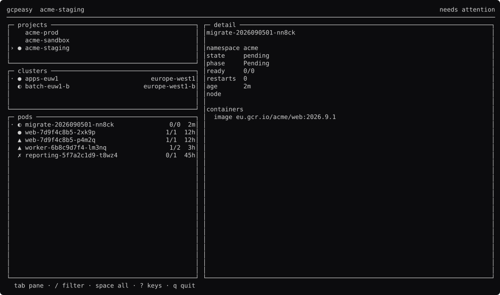
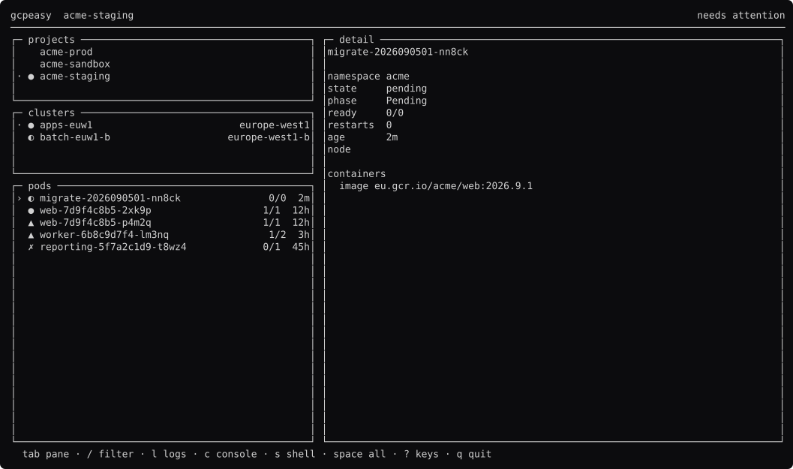
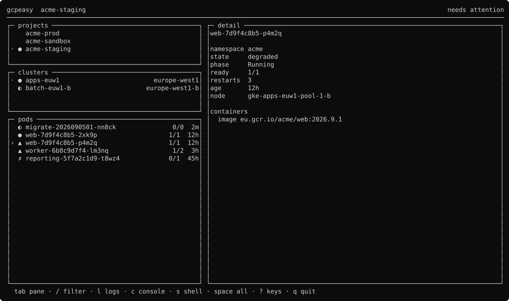
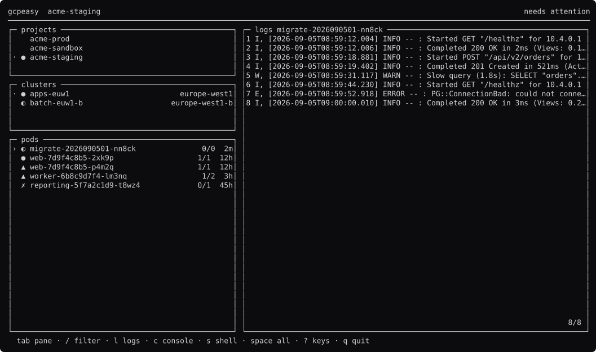
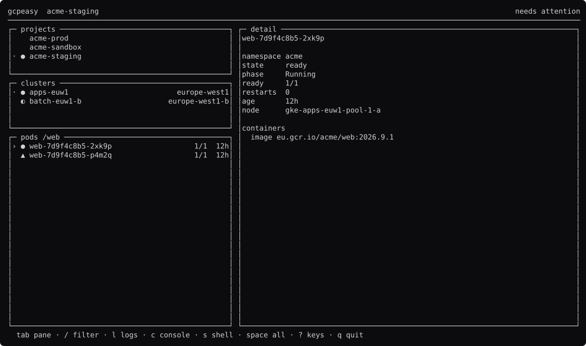
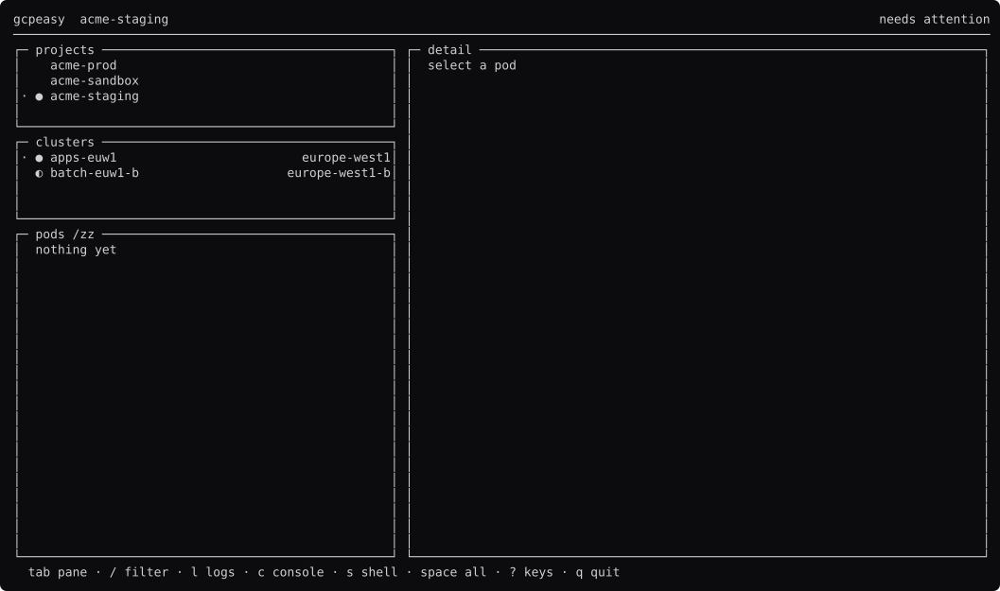
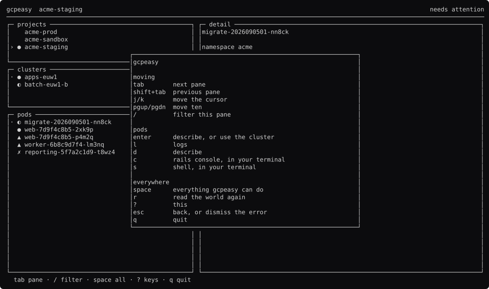
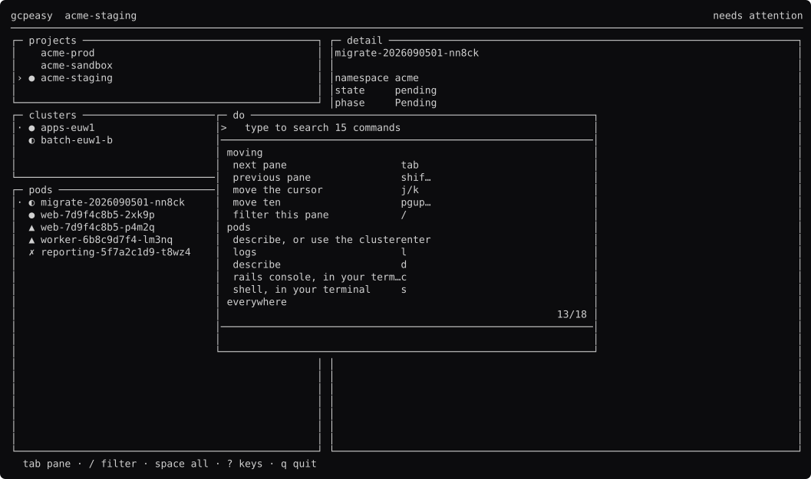
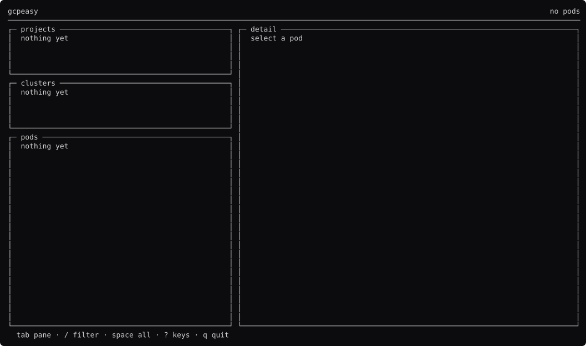

# gcpeasy, screen by screen

Generated by `go run ./docs -shots`. Edit the capture, not this file.

### browsing

Three lists in the order the data depends on. A project chooses the clusters; a cluster chooses the pods.

### pods

`tab` twice. `comp.Focus` holds which pane has the keyboard, and only that pane's cursor is drawn bright.

### pod-detail

`comp.Detail` — labels line up per block, so a long key does not drag the facts above it wide.

### logs

`l` reads the pod's output into a `comp.Viewer`. Not a `LogPane`: a log you asked for once has a bottom.

### filtering

`/` filters the focused pane only. A filter belongs to the pane it was typed in.

### nothing-matches

An ordinary state, not an error.

### help

`?` is `comp.Keys`, built from the same list the footer is.

### palette

`space` is `comp.Palette`. It runs a KEY, so whatever it does the reader has just been shown how to do it without the palette.

### empty

Before anything has loaded.

