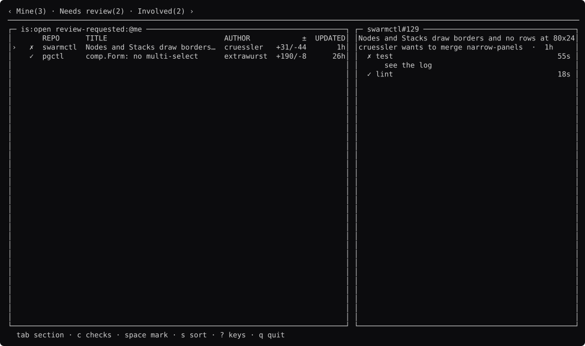

# gh-dash, rebuilt

```
go run ./gh-dash          open it
go run ./gh-dash -shots   regenerate the screenshots
```

It does not talk to GitHub. See [`fake/`](fake/).



Every screen: **[docs/screens.md](docs/screens.md)**. The analysis:
**[STUDY.md](STUDY.md)**.

## The one where the saving is in `app`, not `comp`

Every other study here measures components. gh-dash's measures a function.

`internal/tui/ui.go` is 1,917 lines. **`Update` alone is 741** — 39% of the
file. `View` and its two helpers are 275, and `comp` would not save much of
that.

This model's `Update` is **32 lines**, and there is a test that reads the source
and fails if it grows past 60:

```
ui_test.go:33: Update is 32 lines
```

The difference is not cleverness. `app.Keys` owns the routing order — capture,
then screen, then global. `comp.List` owns its own viewport and cursor.
`app.Stack` would own the history if this rebuild had screens to move between.
Those 741 lines are what happens when a competent person on the same substrate
has to hold all of it themselves.

That is the argument for the `app` package that the four private tools it was
extracted from cannot make about themselves.

## What else it uses

| gh-dash wrote | this uses |
| --- | --- |
| `components/tabs/` | `comp.Tabs`, with a count per section |
| `components/prssection/`, `prrow/` | `comp.Table` + `comp.List` |
| `components/prview/` | `comp.Viewer` for the body |
| `components/prview/checks.go`, 18.9 kB | `comp.StepList` |
| `components/section/section.go` | `comp.Pane`, `comp.Split` |

The check glyphs are the **tool's**, passed to `StepList` as a `[5]StepLook`.
That is the right way round, and a closed glyph set is why: a component
choosing `✓` would be choosing a character the tool's own guard has to allow.

## One rule this adds

**CI's answer is a character, not a colour.** `✓ ✗ ◐ ·` in the first column, so
a red build is visible in a pipe and to a reader who cannot see red. There is a
test that strips the colour and looks for the `✗`.

## What is still theirs, and it is the better half

**The dashboard is a YAML file.** `internal/config/parser.go` is 881 lines and
lets a user define their own sections, and per-column `Width` and `Hidden`.

This rebuild's sections are compiled in. tuikit cannot load a layout from data
([tuikit#60](https://github.com/richarddavenport/tuikit/issues/60)), and for a
dashboard "the user arranges it" is a large part of the product.

`comp.Table.Column` already has a `Width`, so hiding and sizing columns from
config is the cheap half and is not blocked by the guards. The section
definitions are the harder half.
