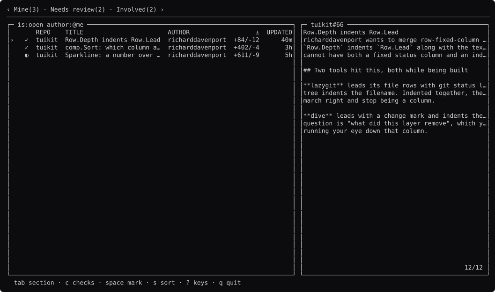
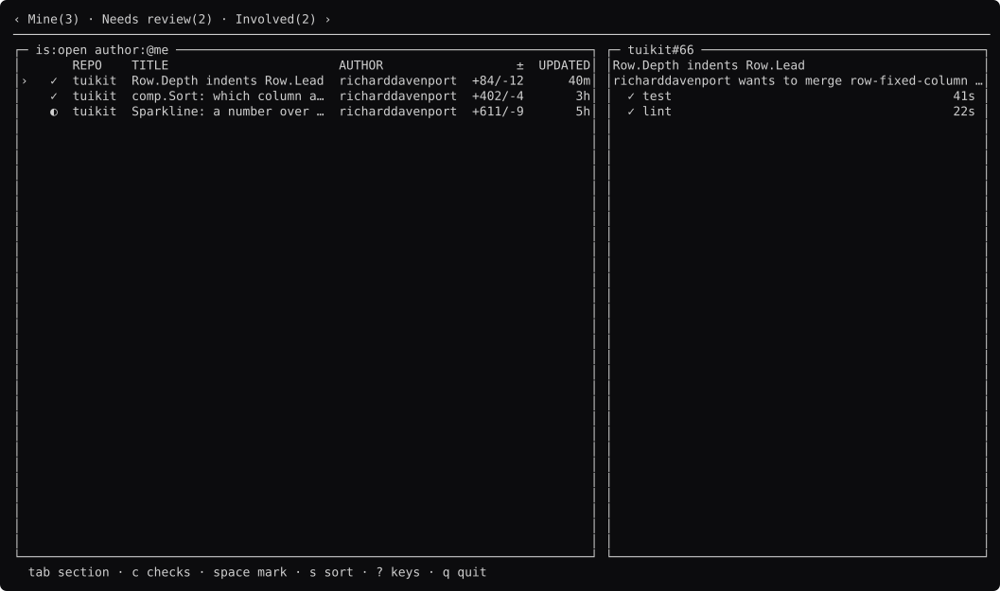
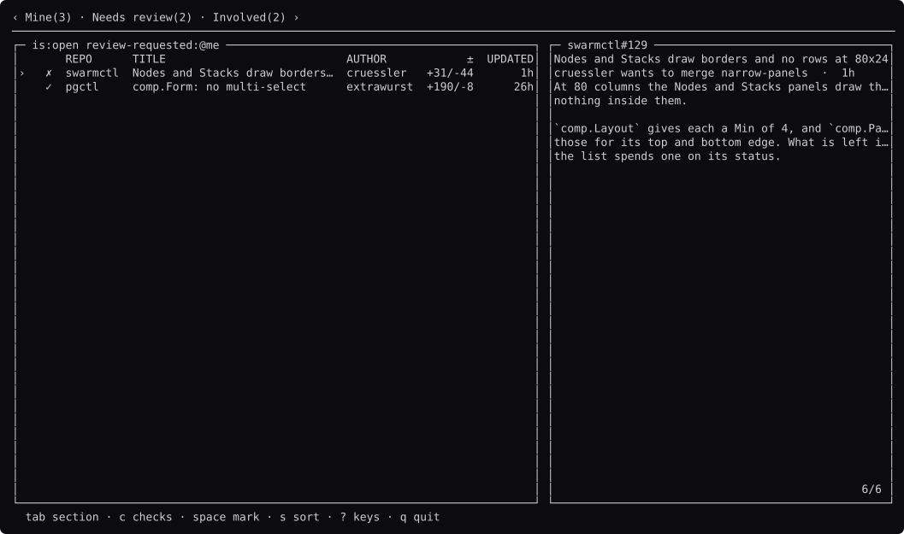
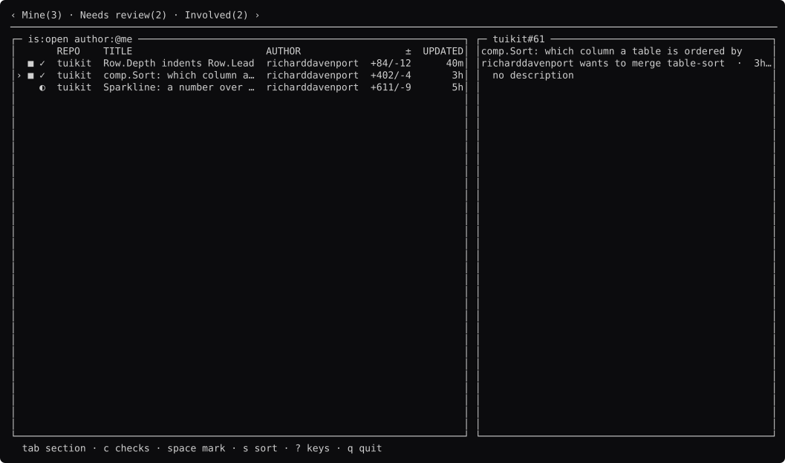
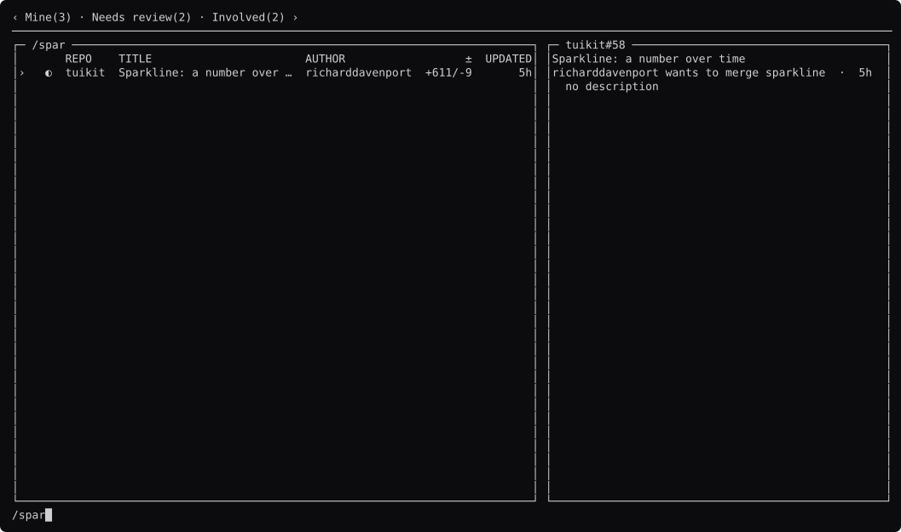
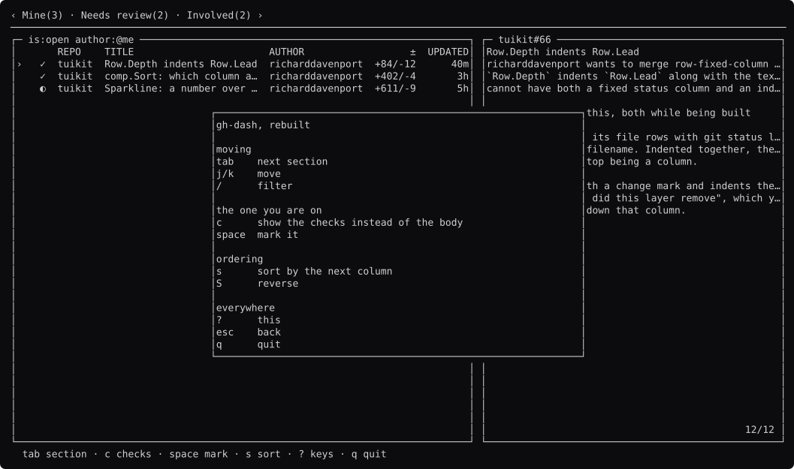

# gh-dash, screen by screen

Generated by `go run ./docs -shots`. Edit the capture, not this file.

### browsing

Sections as `comp.Tabs` with a count each, a table of pull requests, and a sidebar. CI's answer is a CHARACTER in the first column, so it survives the color being stripped.

### body

The sidebar shows the description in a `comp.Viewer` — the one component gh-dash's study said it was missing.

### checks

`c` swaps the body for the CI runs. `comp.StepList`: what will happen, what has, and what it cost.

### failing-checks

A section where CI is red. The glyphs are the tool's, not the component's.

### next-section

`tab`. Each section is its own query; gh-dash's are defined in YAML, which is the part tuikit cannot do.

### sorted

`s` cycles the column. `comp.Sort` hands back indices; the comparison stays the tool's.

### marked

`space` on two. `comp.Marks`, keyed by repo and number.

### filtering

`/` captures the keyboard.

### help

`?`.

