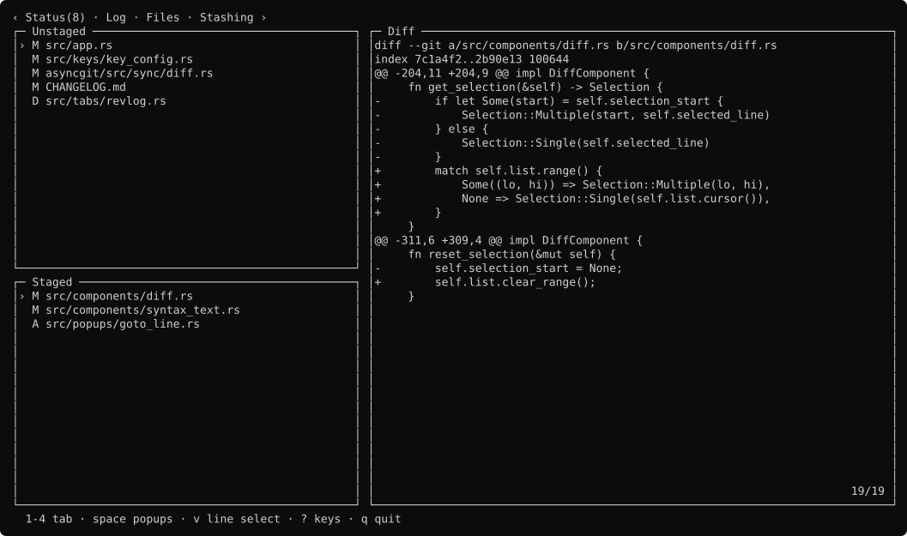
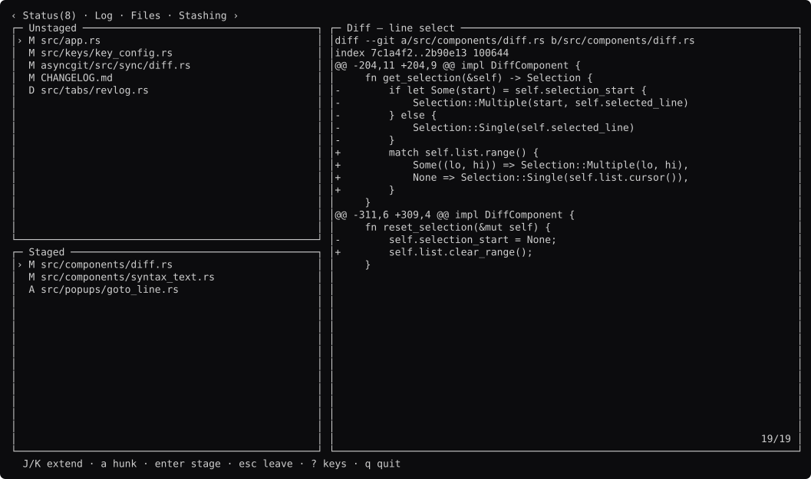
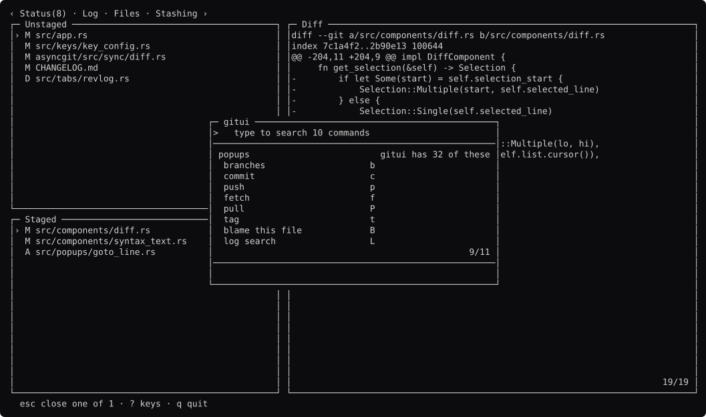
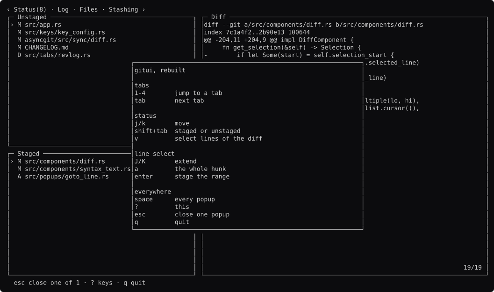
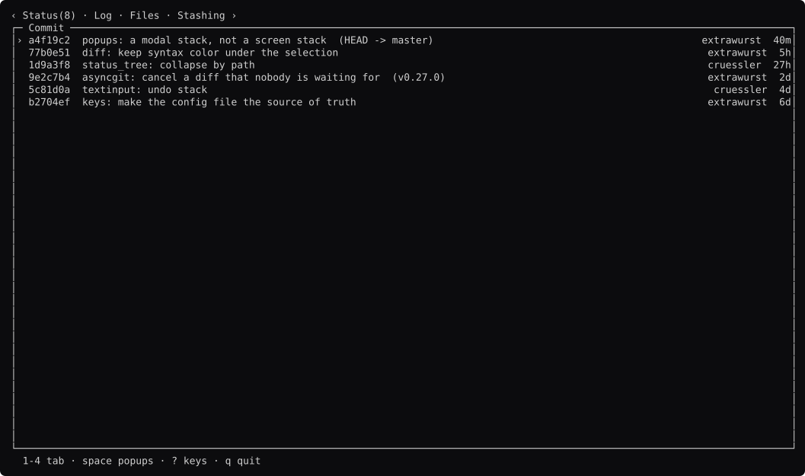
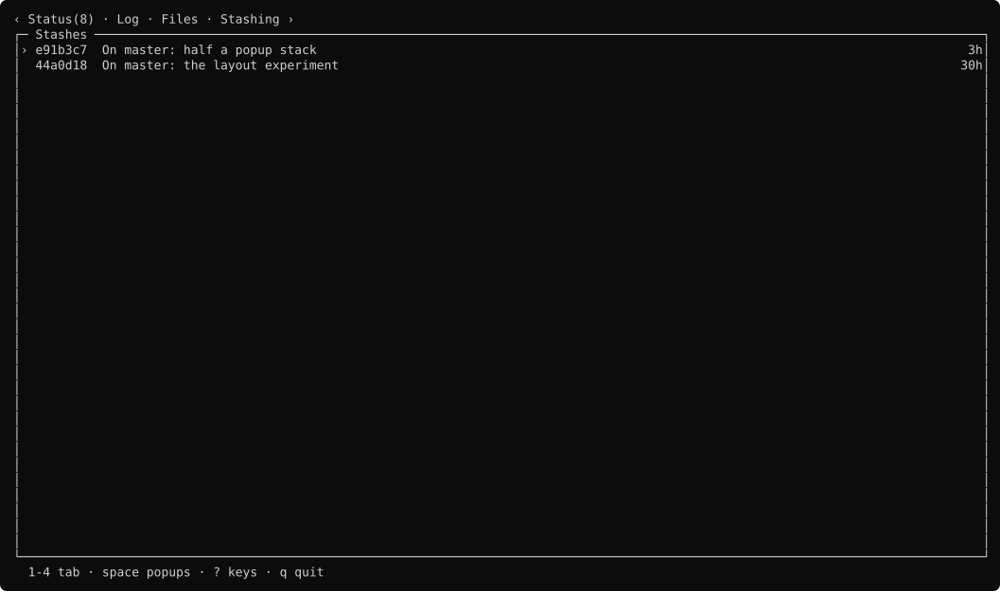

# gitui, screen by screen

Generated by `go run ./docs -shots`. Edit the capture, not this file.

### status

Unstaged and staged on the left, the diff on the right. `comp.Tabs` carries a count on the tab it belongs to.

### staged-focused

`shift+tab`. `comp.Focus` moves between the two lists by region name.

### line-select

`v`. The diff is a `comp.Viewer` — it opens at the top and follows nothing.

### range

`J` three times. The range is a background only, so every line keeps its added or removed colour.

### whole-hunk

`a` snaps to the hunk boundaries.

### palette

`space`. gitui has 32 popup files; this is ten of them in a `comp.Palette`.

### stacked

**The gap this rebuild found.** A popup opened FROM a popup. The palette is still underneath and `esc` comes back to it — `app.Stack` is about screens and has nothing to say about this.

### help

`?` from the screen. A popup CAPTURES every key — `app.Keys` says a capture takes the key whether or not it does anything with it — so `?` inside a confirm closes the confirm rather than stacking help on it. That is the routing working, not a bug.

### log

`2`. `Row.Right` puts the author and age against the edge without anyone doing padding arithmetic.

### stashing

`4`.

