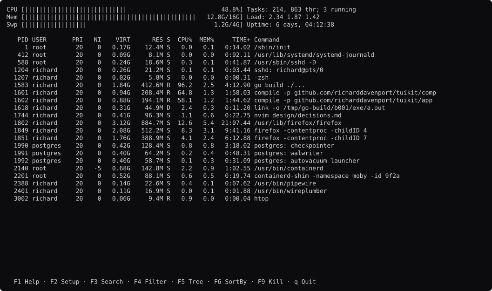
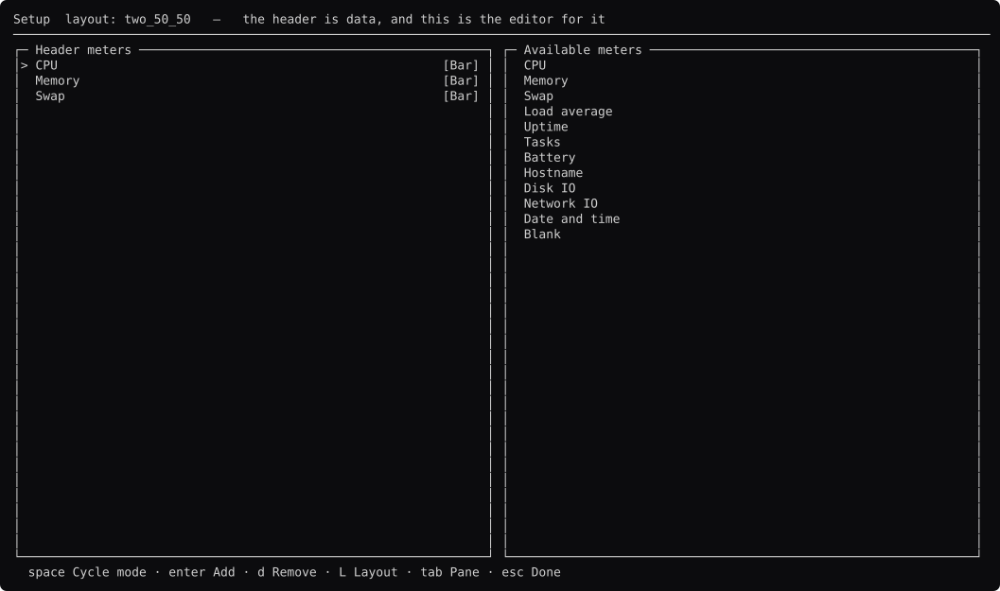
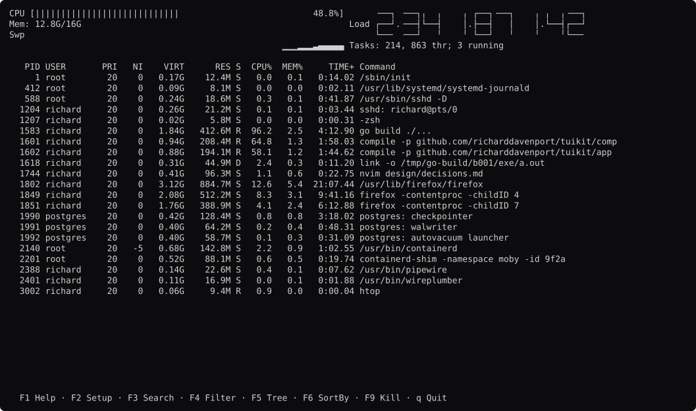
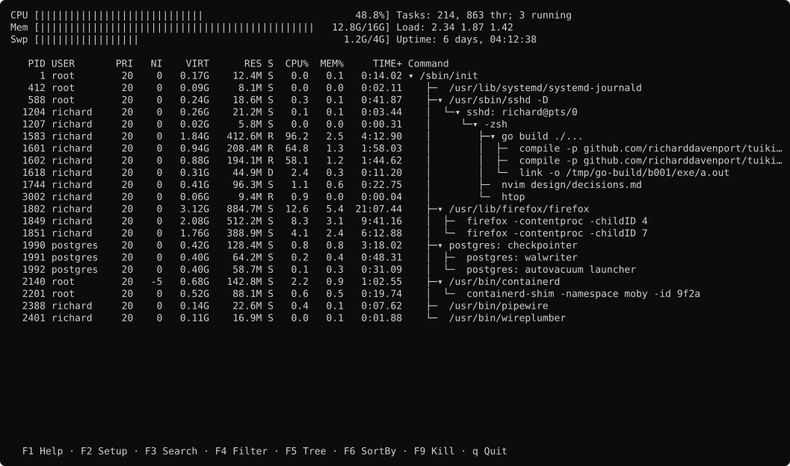
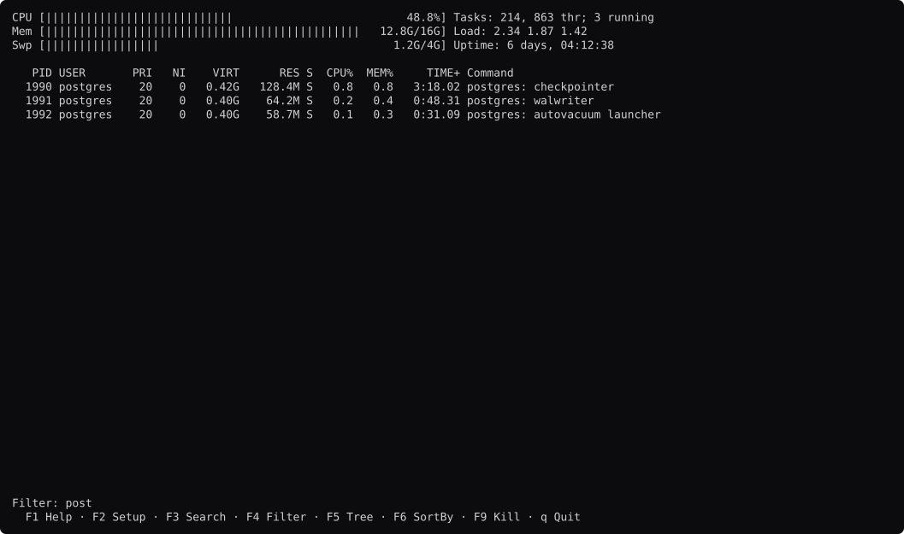

# htop, rebuilt

```
go run ./htop          open it
go run ./htop -shots   regenerate the screenshots
```

It does not read this machine. See [`fake/`](fake/).



Every screen: **[docs/screens.md](docs/screens.md)**. The analysis:
**[STUDY.md](STUDY.md)**.

## Two questions, and they have different answers

**Could tuikit draw htop?** Yes, and it needed nothing new. Every screen here is
built from components that already existed.

**Would htop have been easier to write in tuikit?** Yes for the interface, which
is the smaller half of htop. See
[the verdict](STUDY.md#would-it-have-been-easier-in-tuikit). htop is 40,756
lines and 43% of them read eight operating systems.

## Why htop, when bottom is already here

Not for the meters. **htop is here for F2.**



That screen edits the interface. The left pane is the header as it stands, the
right pane is every meter that exists, and the arrow keys move meters between
them. htop then writes the result to `~/.config/htop/htoprc` and starts there
next time. It spends 1,412 lines on this across five files.

**This is [tuikit#60](https://github.com/richarddavenport/tuikit/issues/60) from
the far end.** bottom and gh-dash read an arrangement from a file once, at
startup. htop lets a reader build one with the keyboard, which needs the
arrangement to be a value the program can *mutate and serialise* — not just one
it can parse.

And it does not cost the guards anything. **The available list is closed.** A
reader picks from it and cannot type a name, so no arrangement can name a meter
the program has no drawing for. That is a stronger guarantee than parsing
someone's TOML, which is what #60 was stuck on.

## The header's height is not a number anyone wrote

```go
bands := comp.Layout{Constraints: []comp.Constraint{
	comp.Length(m.headerRows() + 1),
	comp.Fill(1).Min(3),
	...
```

`headerRows()` asks the arrangement. A bar meter is one row, a graph is two, an
LED is three — so adding one pushes the table down, and there is no second
constant to keep in step. That is the difference between a layout in the code
and a layout in the data, and there is a test for it.

## Four ways to draw the same number



Bar, Text, Graph and LED, and **the reader picks per meter**. htop's position is
that how a number looks is not the program's decision.

- **Graph is `comp.Sparkline`, unchanged.** Right-aligned against now, which is
  the rule the [bottom study](../bottom/STUDY.md) produced.
- **LED is htop's own** and nothing should supply it. Seven-segment digits built
  out of box characters — **derived from the segment encoding, not copied**.
  htop is GPLv2 and this repository is MIT, so its finished glyph table could
  not come across. Our `1` is a bare stroke where htop draws a little flag on
  it, which is htop's own idea and the nicer of the two.
- **Bar and Text** are shapes `comp.Meter` could grow a `Mode` for.

## The gap this one found



**`comp.Tree` indents. It does not draw branches.**

Which connector a row gets cannot be derived from its depth. Row 1204 needs a
`│` in its first column because something above it still has siblings coming;
another row at the same depth does not. htop keeps a bitmask for this
(`Table_buildTreeBranch`), and **dive keeps three string constants** — two
tools, so [tuikit#78](https://github.com/richarddavenport/tuikit/issues/78) is
filed.

Building it found the sharper version. htop puts the tree **inside the Command
column**, because a prefix in front of the PID makes every numeric column
ragged. `Row.Depth` indents a whole row and so could not have been used here at
all.

It also found that **our own dive rebuild draws no branch lines** and nobody
noticed.

## The guard earned its keep twice

Both glyph additions in `theme.go` came from `guard.Glyphs` failing, not from
looking at a screenshot:

```
glyph '╴' (U+2574) is printed by meters.go but not in the glyph set
```

`├` for the tree and five half-width box pieces for the LED digits. Each is
recorded with a reason beside it, which is what `theme.GlyphSet.With` asks for.

## Search and filter are one control



`IncSet.c` holds one editor and an `isFilter` flag. **F3 moves the cursor to a
match and leaves every row on screen. F4 removes the rows that do not match.**

`comp.Input` is the editor and `fuzzy` is the matching, so both halves exist and
the pairing does not. There is a test asserting the two behave differently,
because a screenshot of the input line cannot tell them apart.

## What is still theirs, and it is most of htop

**17,622 lines across eight platform directories.** `linux/` alone is 8,559 —
`/proc` parsing, one file per data source. `darwin/` is 2,051 of `sysctl` and
Mach calls.

That is 43% of htop and no framework supplies a line of it.

## Where htop is better

**Eight colour schemes.** Default, Monochrome, Black-on-White, Light Terminal,
Midnight, Black Night, Broken Gray, Nord.

Decision 28 puts tuikit on ANSI 0–15 so the reader's theme wins, and that is
right for a tool you open for thirty seconds. htop is not that tool. It runs on
a server you SSH into, in a terminal whose theme is whatever the last person
set. **Monochrome exists because some terminals have no colour, and
Black-on-White because ANSI 0–15 does not save you on a white background.**

tuikit has no answer. A tool *could* ship eight palettes, but nothing in `comp`
offers them or persists the choice, and `guard.Tokens` assumes there is one.
