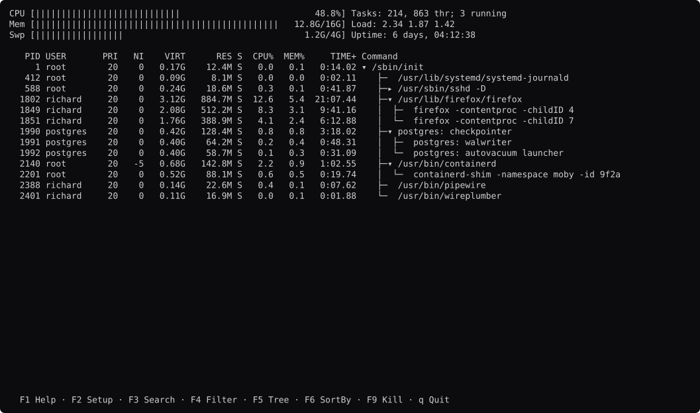
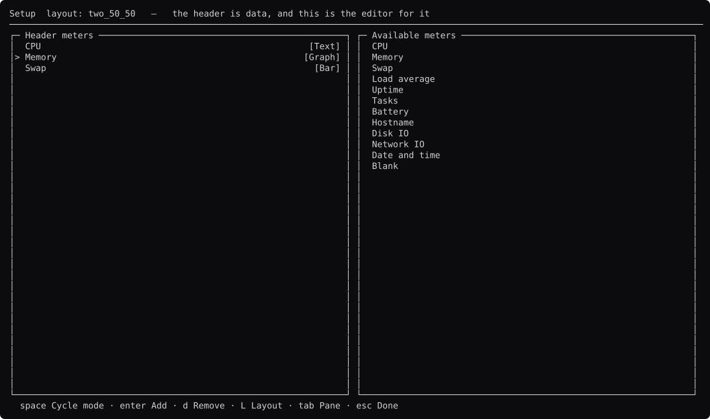
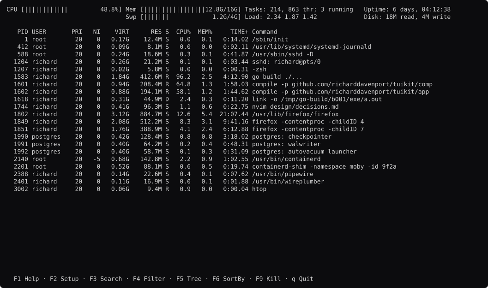
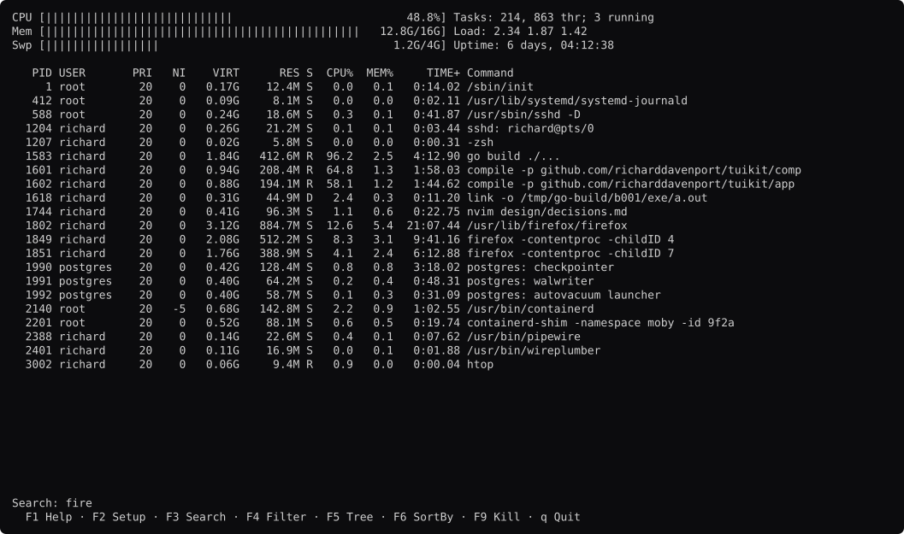
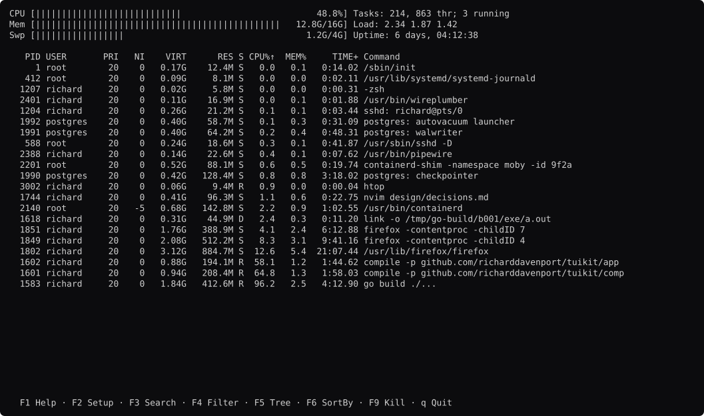
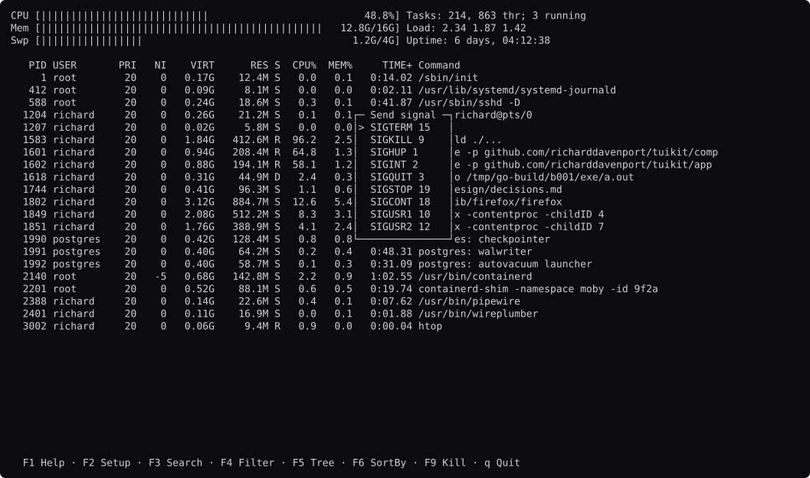
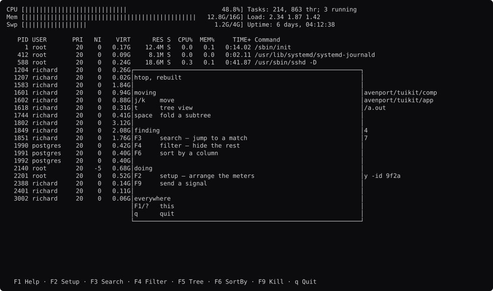

# htop, screen by screen

Generated by `go run ./docs -shots`. Edit the capture, not this file.

### browsing

The default arrangement: meters in two columns, then the process table. The header's height is computed from the arrangement, not written down.

### tree

`F5`. The branch lines are the tool's — `comp.Tree` says which rows exist and `Row.Depth` indents, but nothing in `comp` draws ├ and │. See tuikit#78.

### folded

`space` on a subtree. `comp.Tree` keys collapse state by PID, so a filter that removes a row above cannot fold a different process.

### setup

`F2`, and the reason htop is here. The left pane is the header being edited; the right is every meter that exists. The list is closed, which is what keeps the guards working.

### setup-modes

`space` cycles a meter's mode. htop's four — Bar, Text, Graph, LED — are a per-meter choice a reader saves, not a decision the drawing makes.

### meter-modes

The same three numbers drawn four ways at once. Graph is `comp.Sparkline`; the LED digits are htop's own and nothing should supply them.

### four-columns

`L` in Setup. Thirteen named splits in htop's `HeaderLayout.h` are thirteen sets of `comp.Percent` constraints.

### search

`F3`. The cursor jumps to a match and every row stays on screen.

### filter

`F4`, the same editor and a different meaning: rows that do not match are gone. htop shares one `IncSet` between the two.

### sorted

`F6` then enter. `comp.Sort` holds the column and the direction and marks the header.

### signal

`F9`. The same picker as F6 with different contents, which is what htop's `Panel` is for.

### help

`F1`.

