# k9s, screen by screen

Generated by `go run ./docs -shots`. Edit the capture, not this file.

### browsing

One table. `comp.Table` lays the columns out and `comp.List` scrolls and selects them — two components composed, which is why `Table` has no cursor.

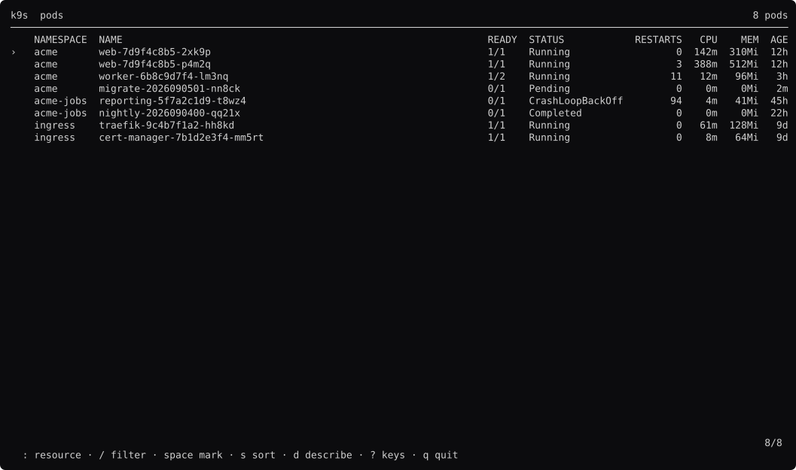

### marked

`space` on three rows. `comp.Marks` keys by namespace/name, so a filter cannot move a mark to a different pod.

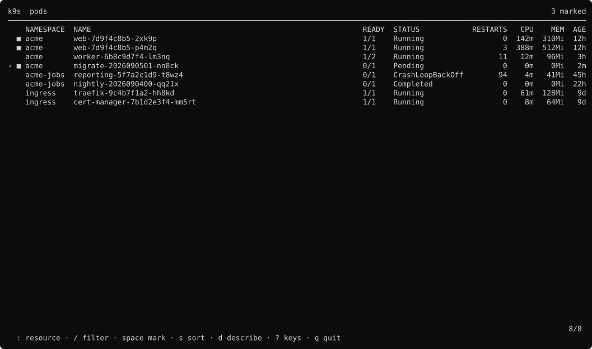

### filled

`ctrl+space` fills from the nearest mark to the cursor. No anchor: the set is primary and the range is derived. k9s's gesture.

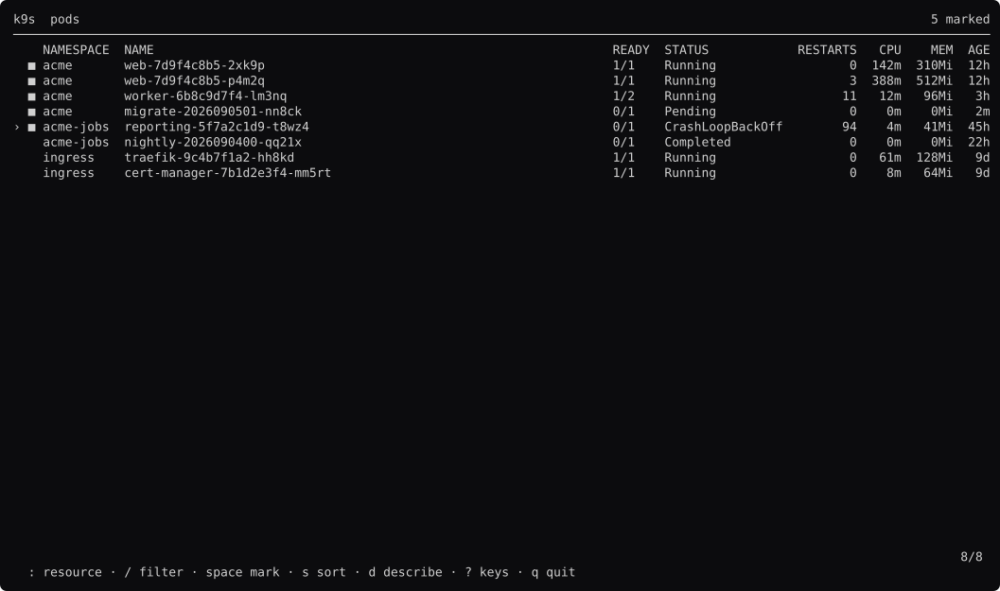

### sorted

`s` cycles the sort column; the arrow comes from `theme.Chrome`. The comparison stays the tool's — ordering an age against a byte count is a domain question.

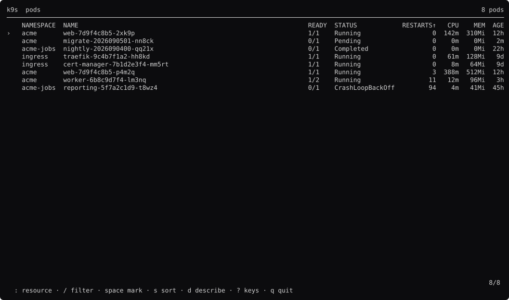

### sorted-desc

`S` reverses. `comp.Sort` is stable, so rows that tie keep the order the fixture built them in.

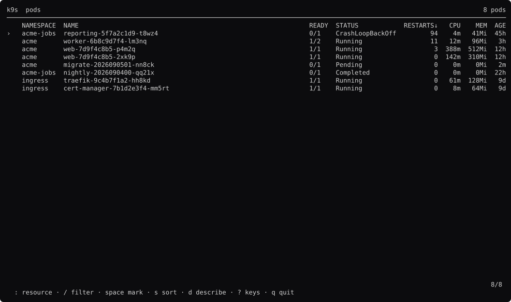

### filtering

`/` captures the keyboard. While it does, `j` is the letter j.

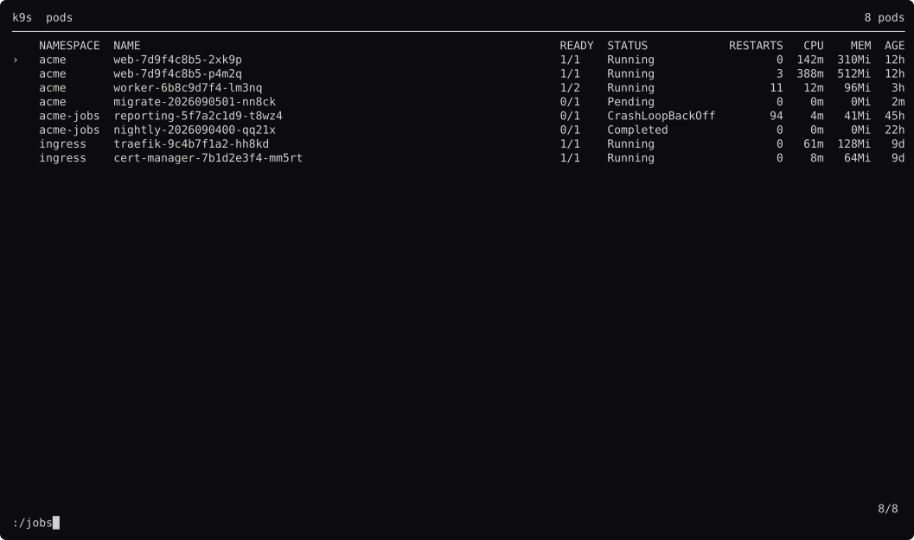

### filtered

Enter. Marks made before the filter survive it, because they are kept by identity.

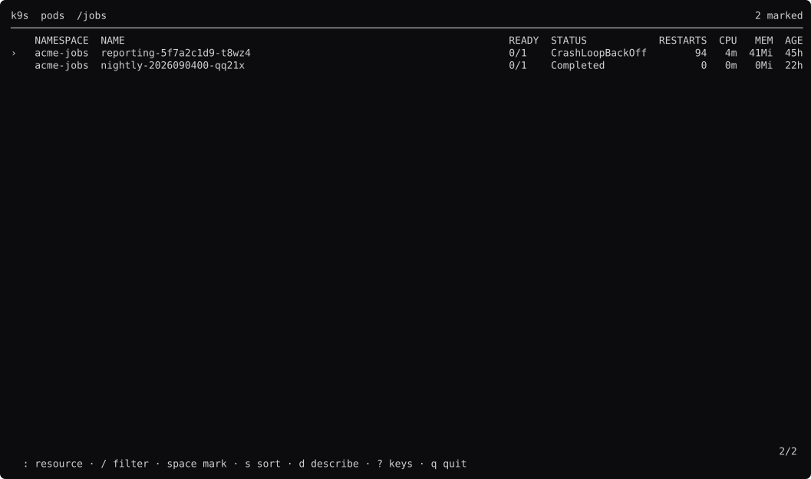

### describe

`d` opens `kubectl describe` in a `comp.Viewer`. Not a `LogPane`: describe output opens at the top and follows nothing.

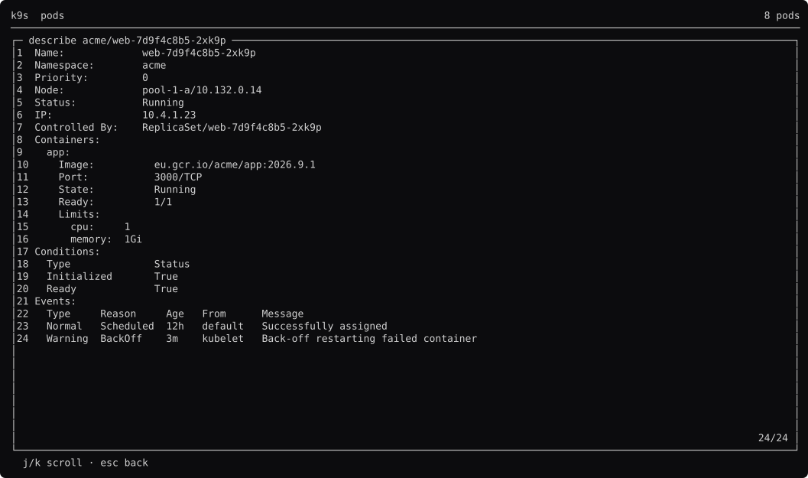

### delete

`ctrl+d`. `Marks.Acting` returns the marks, or the cursor when there are none — one code path for both.

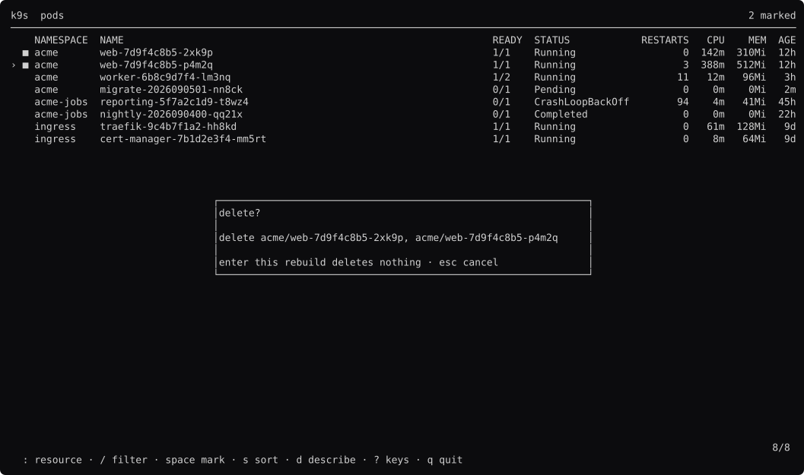

### delete-one

The same key with nothing marked. This is the `if` every call site would otherwise write.

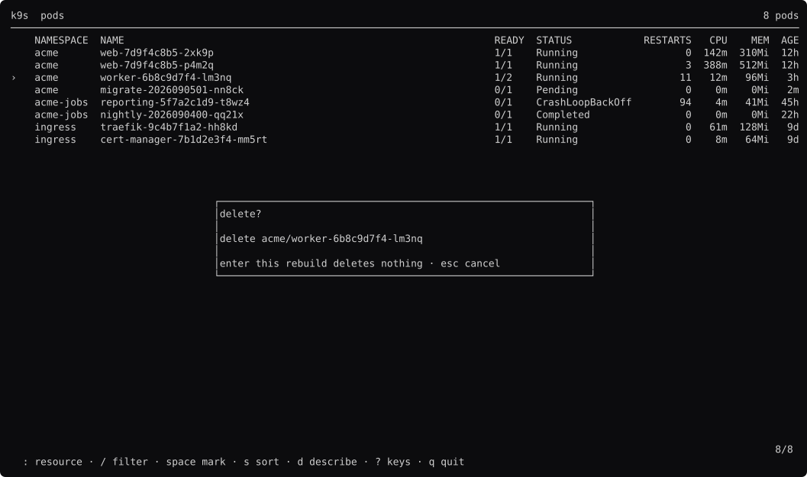

### help

`?`.

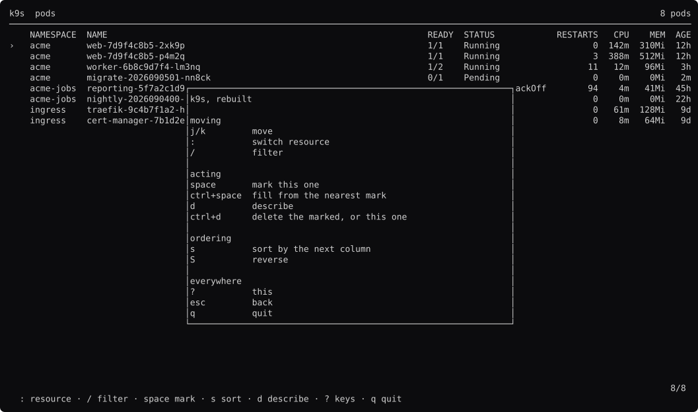

