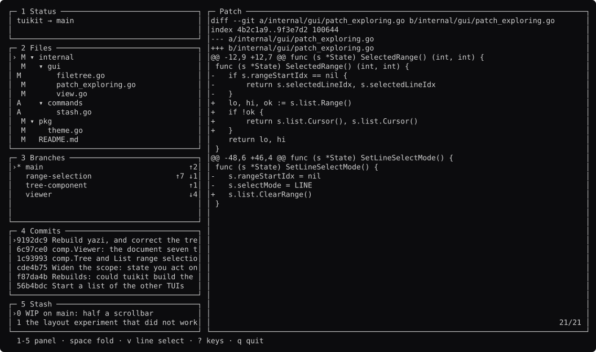
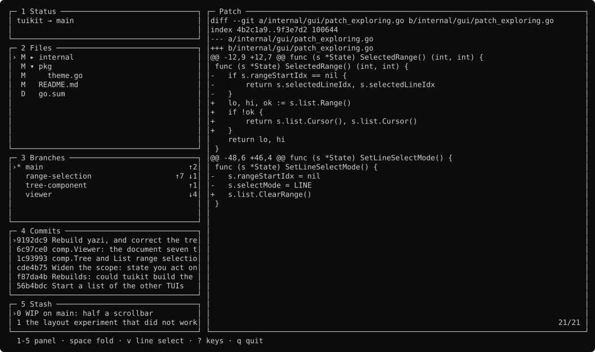
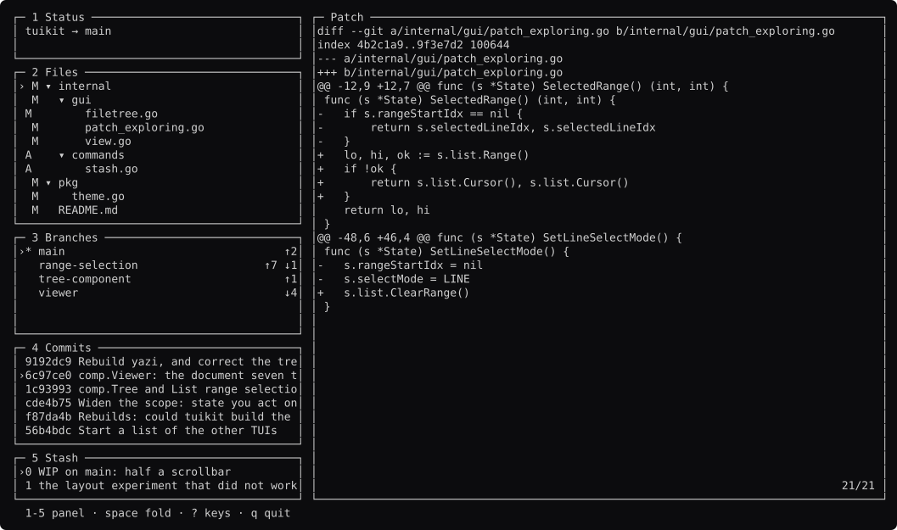
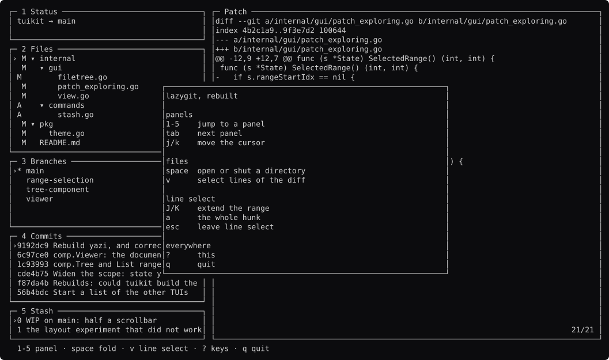

# lazygit, screen by screen

Generated by `go run ./docs -shots`. Edit the capture, not this file.

### browsing

Four panels and a diff. The file panel is a `comp.List` whose rows a `comp.Tree` decides.

### folded

`space` on a directory. `comp.Tree` holds the collapse state, keyed by path rather than by index, and draws nothing.

### line-select

`v` enters line select. The diff is a `comp.Viewer`, which opens at the top and does not tail.

### range

`J` extends. The range is a background only, so every line keeps its own added or removed colour.

### whole-hunk

`a` snaps the range to the hunk. lazygit carries 13 kB of state for this.

### commits

`4` moves the keyboard. Only the focused panel's cursor is drawn bright.

### help

`?` is `comp.Keys`, built from the same list the footer is.

