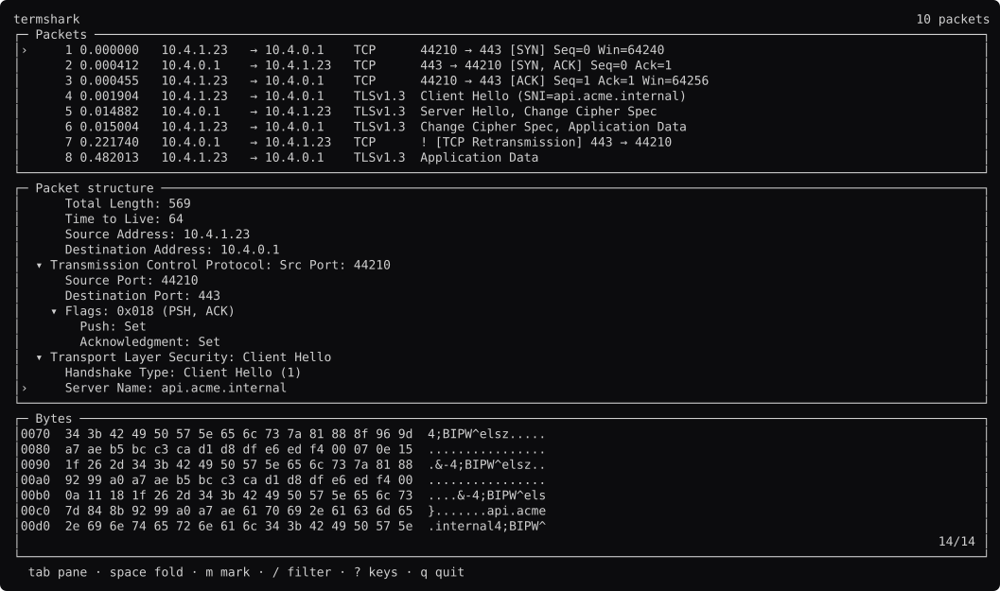

# termshark, rebuilt

```
go run ./termshark          open it
go run ./termshark -shots   regenerate the screenshots
```

It does not run tshark. See [`fake/`](fake/).



Every screen: **[docs/screens.md](docs/screens.md)**. The analysis:
**[STUDY.md](STUDY.md)**.

## Two questions, and they have different answers

**Could tuikit draw termshark?** When the study was written, no. tuikit had no
way to say which pane the keyboard is in, and termshark is three panes you move
between. That study is why `comp.Focus` was built, so the answer is now yes.

**Would termshark have been easier to write in tuikit?** No. It would gain a
palette and a split, and it would lose a focus system better than ours. The
full reasoning is in
[the verdict](STUDY.md#would-it-have-been-easier-in-tuikit).

The rest of this page is about the first question.

## What `comp.Focus` took from gowid, and what it left

termshark has *five* widgets for focus: `framefocus`, `trackfocus`,
`renderfocused`, `keepselected`, `enableselected`.

`comp.Focus` is the third pane here making the case. `tab` moves the keyboard
through packets → structure → bytes, by **region name** rather than by index.

```go
m.focus.Ring = []comp.Name{regList, regFields, regHex}
```

What tuikit did **not** copy is gowid's shape. termshark's is a wrapper widget
that frames whatever it contains when that thing has focus. In immediate mode
that is a field, and `Pane.Focused` already is one. The state was the part
worth extracting.

## termshark's trick, and how tuikit does it

Select a field in the tree and the bytes it covers light up in the dump. That
link is the whole tool.

Here it is a `comp.Viewer` range:

```go
lo, hi = f.Off/bytesPerRow, (f.Off+f.Len-1)/bytesPerRow
m.hex.Goto(lo)
m.hex.Extend(hi - lo)
```

The highlight is a **background**, so the hex digits keep their own color
underneath — `comp.Viewer` puts the range style under the spans, which is the
rule that came out of the lazygit study.

Turning a byte span into a line span is the tool's arithmetic, correctly: only
the tool knows a row holds sixteen bytes.

## What it found

**`Viewer.NoCursor` disables the range as well as the cursor.**

The highlight here is not a selection the reader made. It is *derived* from
whichever field is selected in the tree. But `NoCursor` turns off the cursor and
the range together, so a derived highlight cannot exist without a cursor to
anchor it.

Harmless in this case — `Viewer` only paints the cursor when `Focused`, and the
dump is focused only when you tab to it. One tool so far, so it is written down
in `ui.go` rather than filed.

## Also here

`comp.Marks` over the packet list, because termshark's copy mode works over a
table **and** over a tree — which is the argument for the set not being a field
on `List`. `comp.Tree` for the dissection, which is the fourth hand-rolled tree
in the survey.

## What is still theirs

`hexdumper` and `hexdumper2` — two of them, both packet bytes. `streamwidget`,
`ifwidget`, `pdmltree`. TCP reassembly, interface selection, and the dissection
itself. That is the program, and a framework supplying any of it would be wrong.
