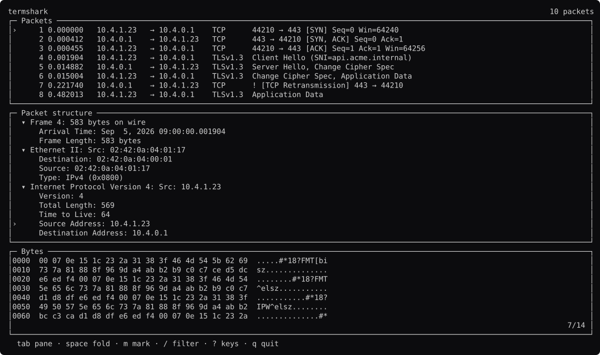
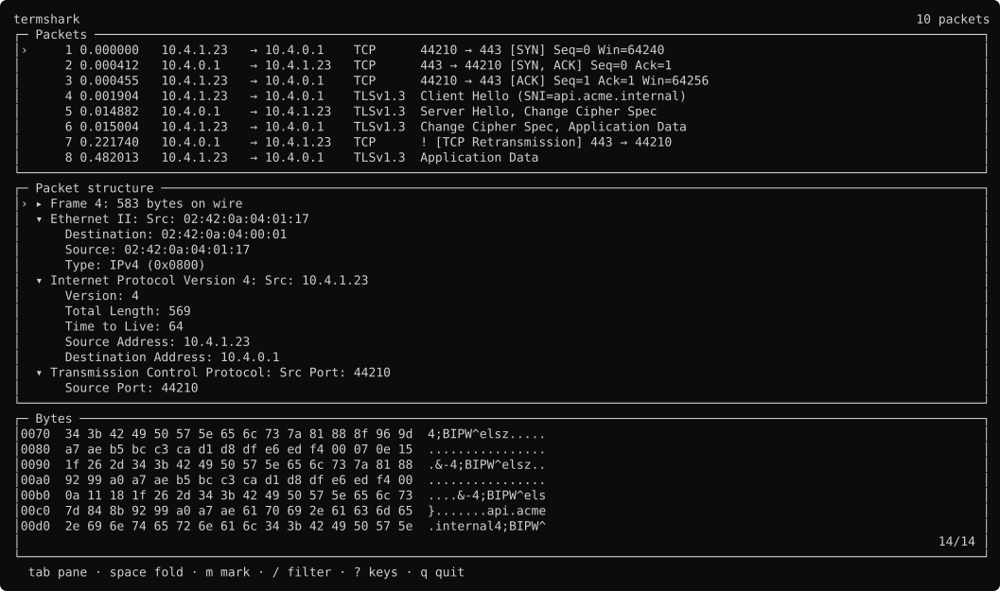
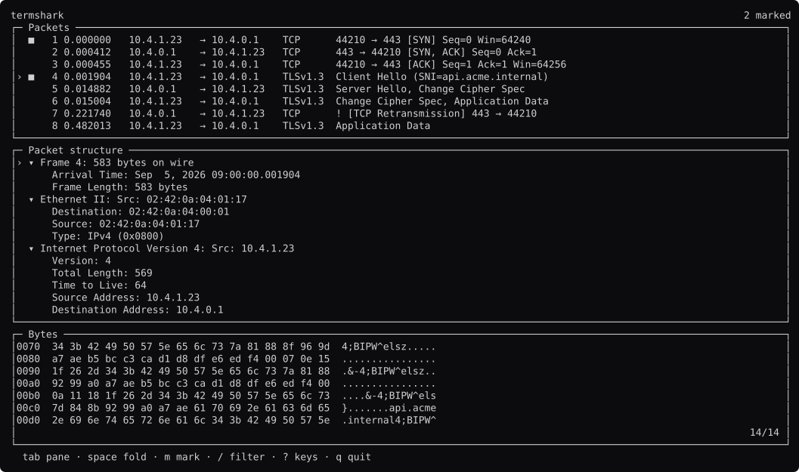
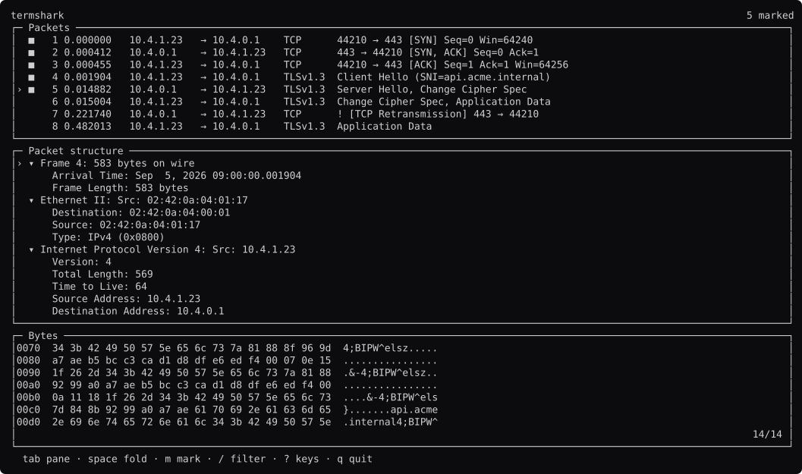
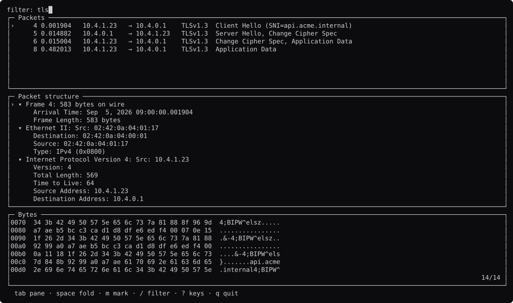
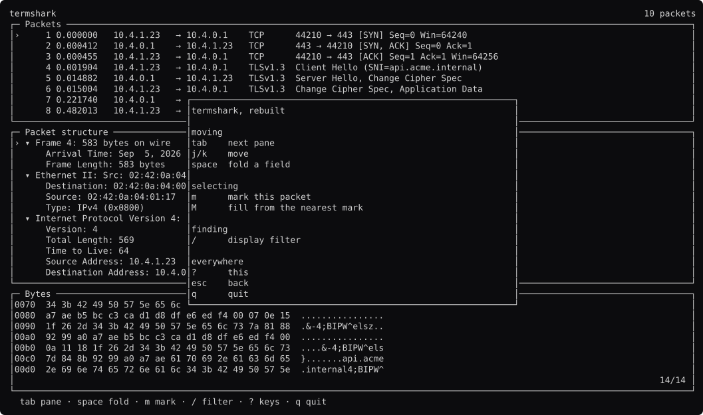

# termshark, screen by screen

Generated by `go run ./docs -shots`. Edit the capture, not this file.

### browsing

Three panes. The selected field's bytes are highlighted in the dump — a `comp.Viewer` range, which is a background, so the hex digits keep their color.

### field-selected

`tab` to the tree, then down to the source address. The highlight in the dump follows. That link is termshark's whole trick.

### sni

The TLS server name, 200 bytes in. `Viewer.Goto` scrolls the dump to it.

### folded

`space` on a protocol. `comp.Tree` decides which rows exist.

### marked

`m` on two packets. `comp.Marks` is not a field on `List` — termshark has a copy mode over the table AND over the tree.

### filled

`M` fills from the nearest mark to the cursor.

### filtering

`/` captures the keyboard.

### hex-focused

`tab` twice more. `comp.Focus` moves the keyboard through three panes by region name.

### help

`?`.

