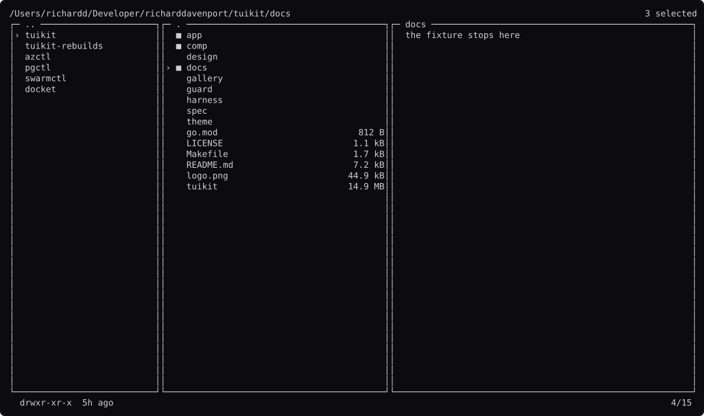

# yazi, rebuilt

```
go run ./yazi          open it
go run ./yazi -shots   regenerate the screenshots
```

It does not touch your filesystem. See [`fake/`](fake/).



Every screen: **[docs/screens.md](docs/screens.md)**. The analysis:
**[STUDY.md](STUDY.md)**.

## No tree, and that is the point

yazi's study first said it needed a collapsible tree, and cited it as one of
seven tools that did. **Reading the source found none** — no match for `tree`
or `collapse` anywhere in yazi. Nor in superfile. Ranger's only collapse is
`collapse_preview`, the preview column.

All three are Miller columns: parent, current, preview. This rebuild is
`comp.Layout.Cols` and nothing else, and there is a test asserting no fold
marker appears in the frame.

That correction sharpened the claim rather than weakening it. **Every file
manager in the field chose columns over a tree.** What needs a tree is a
hierarchy you cannot walk into — image layers, a JSON document, a packet
dissection, a git status.

## Both selection gestures, in one screen each

yazi's arrangement is a live anchored range (`tab/visual.rs`) that commits into
a keyed set (`tab/selected.rs`). k9s's has no anchor at all. `comp.Marks`
offers both, and this rebuild uses yazi's:

- `space` toggles one mark.
- `v` starts a range, `v` again commits it — see `visual` and
  `visual-committed`.

The set is keyed by **path**, so `marks-survive` shows two marks intact after
going down a directory and back.

## What it found

**A range dragged with `comp.List` must be derived, not accumulated.**

The first version stored both ends and updated the far one in the key handler.
It lagged one row behind what the reader could see, every time.

`List.Move` is deferred — its own doc says *"Cursor() between a Move and a Draw
is the old value"* — so a range accumulated in a handler is always a frame
stale. Storing only the anchor and reading the other end from the cursor costs
nothing and cannot go wrong:

```go
func (m *Model) visualRange() (lo, hi int) {
	lo, hi = m.visLow, m.current.Cursor()
	...
}
```

Worth knowing because the bug is invisible until you count the rows in a frame.

## One thing this does that yazi does not

**A marked row carries a character**, not only a color. yazi marks with color
alone; strip that and the selection is gone. `harness.ShapeSurvivesColor` would
not catch it, because the shape is unchanged and the information is what goes
missing.

## What is still theirs, and it is the interesting half

**The Lua.** yazi's whole main surface — `root.lua`, `current.lua`,
`preview.lua`, `status.lua` — is a script its users can replace at runtime.
tuikit declined that bet ([decision 44](https://github.com/richarddavenport/tuikit/blob/main/design/decisions.md)),
because a surface drawn by a user's script cannot be checked by reading the
program, and the guards are the property tuikit exists for.

Both bets are defensible. yazi's is better for a tool with a plugin community.
This rebuild's grid is compiled in, and 42k people like the other answer.
