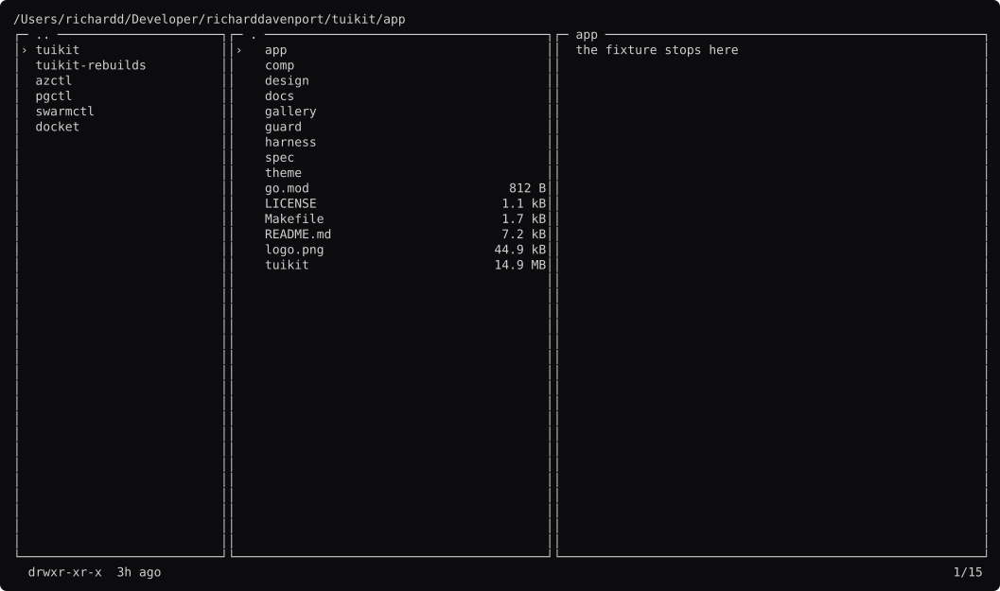
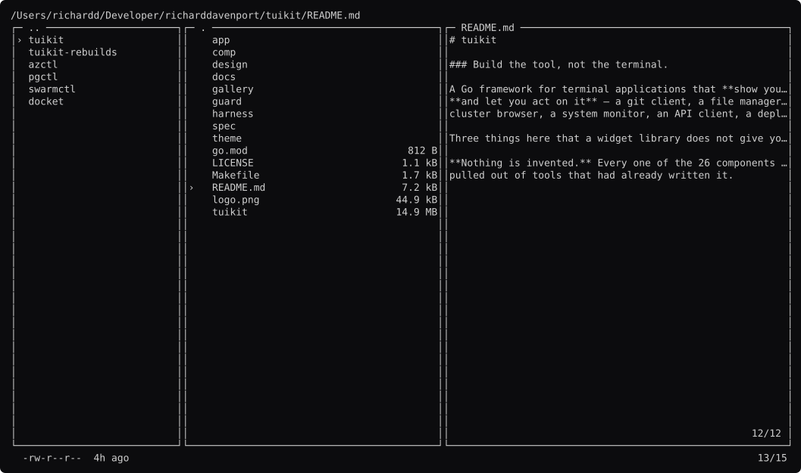
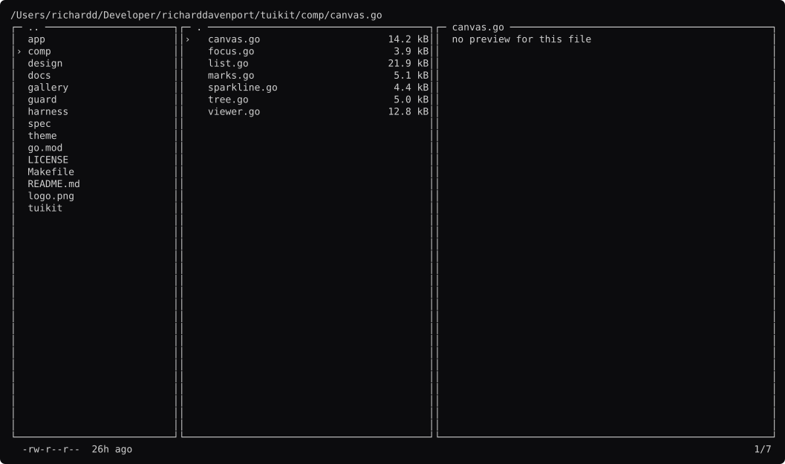
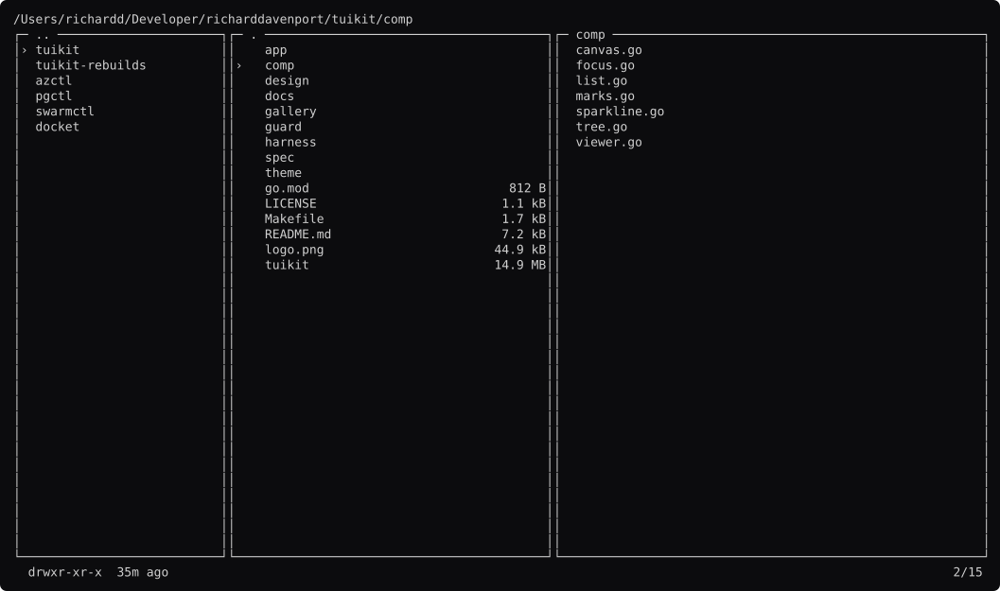
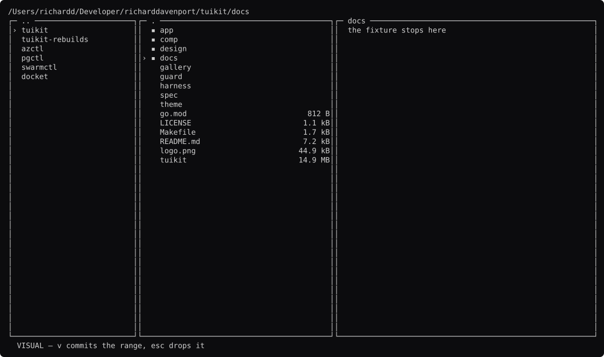
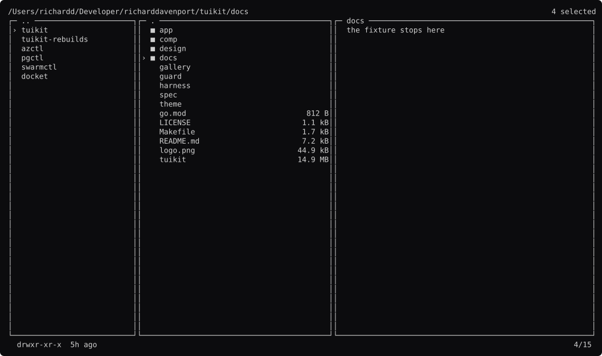
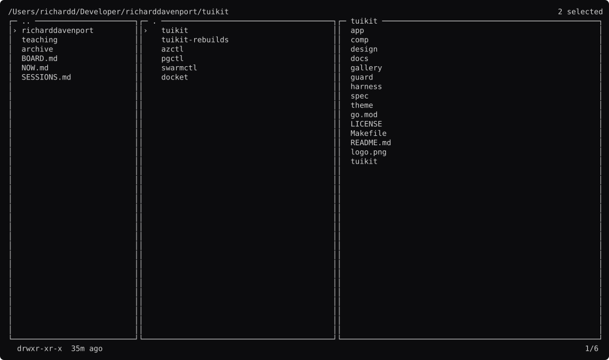
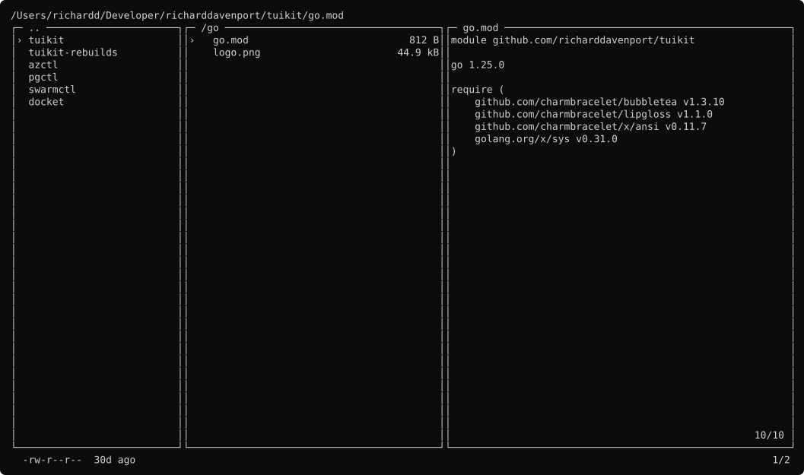
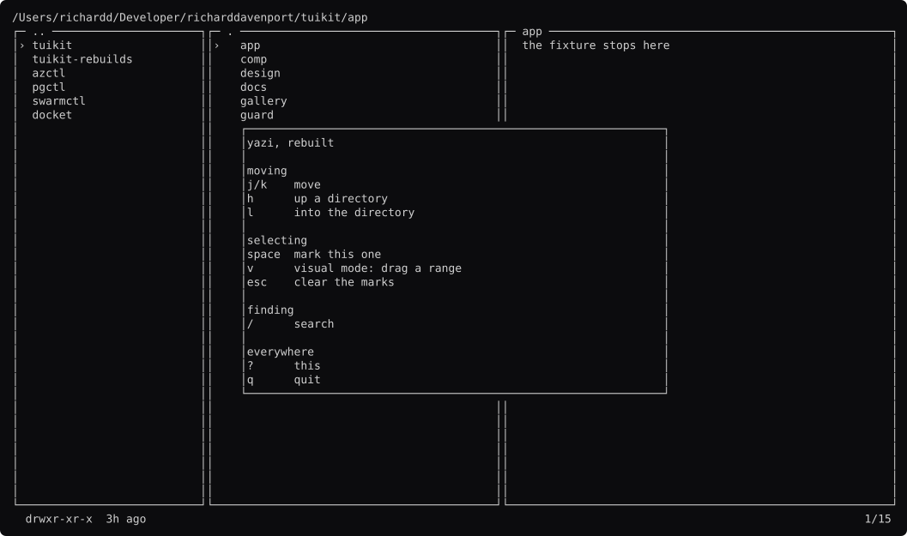

# yazi, screen by screen

Generated by `go run ./docs -shots`. Edit the capture, not this file.

### browsing

Miller columns: parent, current, preview. `comp.Layout.Cols` and nothing more. **No tree** — yazi has none, which is what reading its source corrected.

### file-preview

The third column previews a file. A `comp.Viewer`, so it scrolls and does not tail.

### into

`l` descends. The cursor is remembered per directory, so `h` and `l` feel like moving rather than teleporting.

### back-up

`h` comes back and lands on the directory you came out of — not at the top.

### marked

`space` on three. `comp.Marks` keys by path, so the selection survives leaving the directory and coming back.

### visual

`v` starts a dragged range. This is yazi's gesture: the range is primary and commits into the set. k9s does the opposite, and `comp.Marks` offers both.

### visual-committed

`v` again commits it. The range is gone and four paths are marked.

### marks-survive

Marked, then down a directory and back. Kept by identity, so nothing moved.

### searching

`/` captures the keyboard.

### help

`?`.

